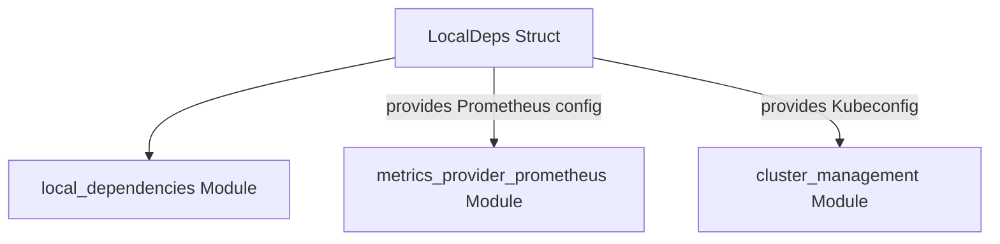

# local_dependency_config Module Documentation

The `local_dependency_config` module is responsible for defining the configuration structure for local dependencies within the system. It specifically outlines parameters required for connecting to a local Kubernetes cluster and a local Prometheus instance.

## Purpose and Core Functionality

This module provides the `LocalDeps` configuration struct, which encapsulates critical information needed when the system operates in a local development or testing environment. It ensures that the application can correctly locate and interact with essential external services such as Kubernetes and Prometheus without requiring in-cluster discovery mechanisms.

## Architecture and Component Relationships

The `local_dependency_config` module is a leaf module within the broader [configuration](configuration.md) hierarchy, specifically nested under [dependency_management](dependency_management.md) and [local_dependencies](local_dependencies.md). Its primary component, `LocalDeps`, serves as a direct configuration object.

### Core Components

*   **`pkg.config.config.LocalDeps`**: A Go struct that defines the `kubeconfigPath` and `prometheusURL` fields. These fields are mapped from YAML configuration files and are used to provide explicit paths/URLs for local Kubernetes and Prometheus setups.

## Module Integration and System Fit

This module plays a crucial role in the system's ability to run and function outside of a Kubernetes cluster, relying on local external services. The configurations defined here are consumed by other modules that need to interact with Kubernetes (e.g., for cluster resource management or task execution) and Prometheus (e.g., for metric collection and analysis). For example, modules like [cluster_management](cluster_management.md) would utilize `kubeconfigPath`, and [metrics_provider_prometheus](metrics_provider_prometheus.md) would use `prometheusURL` to establish connections.

## Diagrams

<!-- DIAGRAM_JSON
{
    "direction": "TD",
    "nodes": [
        {"id": "localdeps_struct", "label": "LocalDeps Struct", "type": "component", "link": null},
        {"id": "local_deps_module", "label": "local_dependencies Module", "type": "external", "link": "local_dependencies.md"},
        {"id": "metrics_provider_prometheus", "label": "metrics_provider_prometheus Module", "type": "external", "link": "metrics_provider_prometheus.md"},
        {"id": "cluster_management", "label": "cluster_management Module", "type": "external", "link": "cluster_management.md"}
    ],
    "edges": [
        {"source": "localdeps_struct", "target": "local_deps_module"},
        {"source": "localdeps_struct", "target": "metrics_provider_prometheus", "label": "provides Prometheus config"},
        {"source": "localdeps_struct", "target": "cluster_management", "label": "provides Kubeconfig"}
    ],
    "groups": []
}
-->

