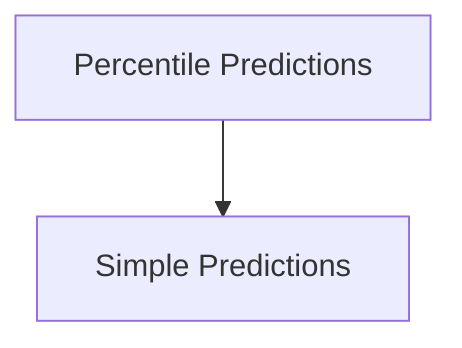

# Machine Learning Predictions Module

## Introduction
The `machine_learning_predictions` module defines the core data structures used to store and represent various machine learning predictions within the system. These predictions are crucial for resource optimization, capacity planning, and identifying potential OOM events. The module includes structures for percentile-based metrics for CPU and memory, as well as simpler, direct prediction values.

## Architecture Overview
The module is composed of two primary sub-modules: `percentile_predictions` and `simple_predictions`.
*   The `percentile_predictions` sub-module encapsulates data types for detailed percentile-based predictions of CPU and memory usage, including a specialized structure for PSI-adjusted CPU usage.
*   The `simple_predictions` sub-module provides a straightforward data structure for representing time-series predictions at different granularities (weekly, hourly, current) along with a maximum observed value.

These sub-modules work together to provide a comprehensive set of data structures for managing and interpreting machine learning-driven insights.

## High-level functionality of each sub-module:

*   **Percentile Predictions**: This sub-module ([percentile_predictions.md](percentile_predictions.md)) handles the detailed statistical representations of resource usage. It stores median, P90, P95, and P99 values for CPU (both raw and PSI-adjusted) and memory, allowing for robust analysis of resource consumption patterns.
*   **Simple Predictions**: This sub-module ([simple_predictions.md](simple_predictions.md)) focuses on aggregated, easy-to-consume prediction values. It provides predictions over different time horizons (weekly, hourly) and the current prediction, useful for immediate decision-making and displaying high-level forecasts.

<!-- DIAGRAM_JSON
{
    "direction": "TD",
    "nodes": [
        {"id": "percentile_predictions", "label": "Percentile Predictions", "type": "module", "link": "percentile_predictions.md"},
        {"id": "simple_predictions", "label": "Simple Predictions", "type": "module", "link": "simple_predictions.md"}
    ],
    "edges": [
        {"source": "percentile_predictions", "target": "simple_predictions", "label": "Data Flow"}
    ],
    "groups": []
}
-->
