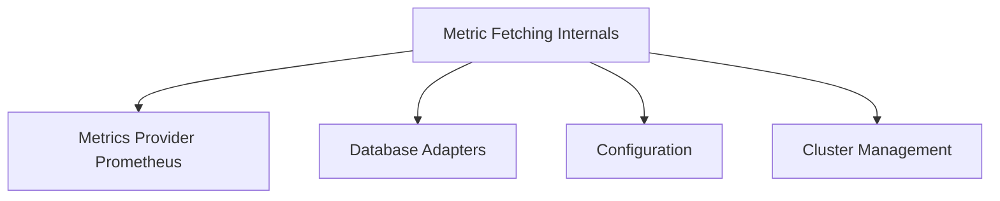

# Metric Fetching Core Module

## Introduction

The `metric_fetching_core` module is responsible for defining and executing tasks related to fetching metrics from various sources, primarily Prometheus. It encapsulates the configuration required for metric fetching tasks and the core logic to interact with Kubernetes, Prometheus, and the storage layer.

## Architecture Overview

This module integrates with Kubernetes for cluster information, Prometheus for metric data, and a local storage solution for persisting fetched metrics. It relies on configuration settings defined in the `configuration` module and leverages clients from `metrics_provider_prometheus` and `database_adapters`.

<!-- DIAGRAM_JSON
{
    "direction": "TD",
    "nodes": [
        {"id": "metric_fetching_internals", "label": "Metric Fetching Internals", "type": "module", "link": "metric_fetching_internals.md"},
        {"id": "metrics_provider_prometheus", "label": "Metrics Provider Prometheus", "type": "external", "link": "metrics_provider_prometheus.md"},
        {"id": "database_adapters", "label": "Database Adapters", "type": "external", "link": "database_adapters.md"},
        {"id": "configuration", "label": "Configuration", "type": "external", "link": "configuration.md"},
        {"id": "cluster_management", "label": "Cluster Management", "type": "external", "link": "cluster_management.md"}
    ],
    "edges": [
        {"source": "metric_fetching_internals", "target": "metrics_provider_prometheus"},
        {"source": "metric_fetching_internals", "target": "database_adapters"},
        {"source": "metric_fetching_internals", "target": "configuration"},
        {"source": "metric_fetching_internals", "target": "cluster_management"}
    ],
    "groups": []
}
-->

## Sub-modules

### [Metric Fetching Internals](metric_fetching_internals.md)

This sub-module defines the fundamental components for metric fetching tasks, including the configuration (`FetchMetricsTaskConfig`) and the core task structure (`FetchMetricsTask`). It details the dependencies on Kubernetes, Prometheus, and the internal storage mechanism required for operation. More details can be found in its dedicated documentation.