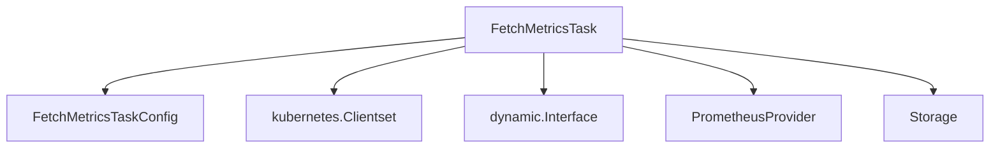

# Module: `metric_fetching_internals`

## Introduction

The `metric_fetching_internals` module defines the core structures and configurations for tasks responsible for fetching metrics within the system. It encapsulates the necessary components for connecting to Kubernetes and Prometheus, as well as for storing the retrieved metric data.

## Core Functionality

This module provides the foundational elements for the `FetchMetricsTask`, which is a scheduled operation designed to collect various metrics from the Kubernetes clusters and Prometheus instances. The task is configured through `FetchMetricsTaskConfig` which dictates its behavior, schedule, and the specific cluster it targets.

## Architecture and Component Relationships

The `metric_fetching_internals` module primarily consists of two core components:

*   **`FetchMetricsTaskConfig`**: This structure defines the configuration parameters for a metric fetching task. It includes properties such as the task's name, whether it's enabled, its execution schedule (e.g., using cron syntax), and the identifier of the Kubernetes cluster it should monitor.

*   **`FetchMetricsTask`**: This is the main task handler. It orchestrates the process of fetching metrics by holding references to various clients and a storage mechanism. Specifically, it utilizes:
    *   `kubeClient` and `dynamicClient`: For interacting with the Kubernetes API to gather cluster-related information.
    *   `promClient`: An instance of `PrometheusProvider` (from the [metrics_provider_prometheus](metrics_provider_prometheus.md) module) responsible for querying metrics from Prometheus.
    *   `storage`: An instance of `Storage` (from the [data_storage_repository](data_storage_repository.md) module) used to persist the fetched metrics.
    *   `config`: A reference to its `FetchMetricsTaskConfig` for operational parameters.

<!-- DIAGRAM_JSON
{
    "direction": "TD",
    "nodes": [
        {"id": "FetchMetricsTask", "label": "FetchMetricsTask", "type": "component", "link": null},
        {"id": "FetchMetricsTaskConfig", "label": "FetchMetricsTaskConfig", "type": "component", "link": null},
        {"id": "kubernetes_clientset", "label": "kubernetes.Clientset", "type": "external", "link": null},
        {"id": "dynamic_interface", "label": "dynamic.Interface", "type": "external", "link": null},
        {"id": "prometheus_provider", "label": "PrometheusProvider", "type": "external", "link": "metrics_provider_prometheus.md"},
        {"id": "storage", "label": "Storage", "type": "external", "link": "data_storage_repository.md"}
    ],
    "edges": [
        {"source": "FetchMetricsTask", "target": "FetchMetricsTaskConfig"},
        {"source": "FetchMetricsTask", "target": "kubernetes_clientset"},
        {"source": "FetchMetricsTask", "target": "dynamic_interface"},
        {"source": "FetchMetricsTask", "target": "prometheus_provider"},
        {"source": "FetchMetricsTask", "target": "storage"}
    ],
    "groups": []
}
-->

## How it Fits into the Overall System

The `metric_fetching_internals` module is a fundamental part of the system's data collection pipeline. It is a leaf module within `metric_fetching_core`, which is part of `metric_fetching_tasks`, itself a sub-module of `task_implementations`. This hierarchical structure indicates that it provides the concrete implementation for a specific type of task: fetching metrics.

It acts as an intermediary, querying metrics from external systems like Prometheus (via `metrics_provider_prometheus`) and Kubernetes, and then persisting this data using the capabilities provided by the `data_storage_repository` module. The collected metrics are vital for various downstream processes, including monitoring, performance analysis, and potentially feeding into recommendation engines or auto-scaling mechanisms. Its scheduled nature ensures continuous and up-to-date data availability for these critical system functions.