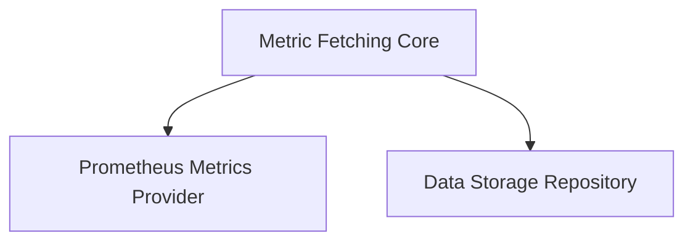

# Metric Fetching Tasks Module

The `metric_fetching_tasks` module is responsible for defining and implementing the task for fetching metrics from various sources within the system. It encapsulates the configuration and logic required to retrieve performance and operational metrics, which are crucial for system monitoring, analysis, and recommendation generation.

## Architecture Overview

This module's core functionality is centered around the `metric_fetching_core` sub-module, which interacts with external services to gather metric data.

<!-- DIAGRAM_JSON
{
    "direction": "TD",
    "nodes": [
        {"id": "metric_fetching_core", "label": "Metric Fetching Core", "type": "module", "link": "metric_fetching_core.md"},
        {"id": "metrics_provider_prometheus", "label": "Prometheus Metrics Provider", "type": "module", "link": "metrics_provider_prometheus.md"},
        {"id": "data_storage_repository", "label": "Data Storage Repository", "type": "module", "link": "data_storage_repository.md"}
    ],
    "edges": [
        {"source": "metric_fetching_core", "target": "metrics_provider_prometheus"},
        {"source": "metric_fetching_core", "target": "data_storage_repository"}
    ],
    "groups": []
}
-->

## Sub-modules

### [Metric Fetching Core](metric_fetching_core.md)
The `metric_fetching_core` sub-module contains the primary components for configuring and executing metric fetching operations. It defines the `FetchMetricsTaskConfig`, which specifies the task's name, enablement status, schedule, and associated cluster ID, and the `FetchMetricsTask` itself, which orchestrates the retrieval of metrics by interacting with Kubernetes clients, a Prometheus provider, and a storage mechanism.
