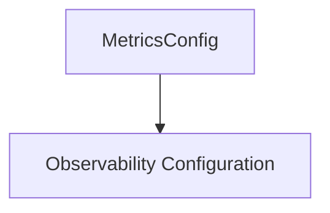

# Metrics Configuration Module

The `metrics_configuration` module is a crucial part of the overall system's [observability configuration](observability_configuration.md). It specifically handles the configuration settings related to the exposure and collection of application metrics.

## Purpose and Core Functionality

This module's primary purpose is to define whether the application's metrics endpoint is enabled and on which port it should be exposed. This allows for integration with external monitoring systems like Prometheus.

The core functionality is encapsulated within the `MetricsConfig` struct:

```go
type MetricsConfig struct {
	Enabled bool   `yaml:"enabled" mapstructure:"enabled"`
	Port    string `yaml:"port" mapstructure:"port"`
}
```

- **`Enabled`**: A boolean flag that determines whether the metrics endpoint is active. If set to `true`, metrics will be exposed; otherwise, they will not.
- **`Port`**: A string representing the network port on which the metrics endpoint will listen for requests.

## Architecture and Component Relationships

The `metrics_configuration` module is a leaf module within the broader [configuration module](configuration.md) and specifically falls under [observability_configuration](observability_configuration.md). It provides the concrete `MetricsConfig` structure that is utilized by the `observability_configuration` to assemble a complete set of monitoring and telemetry settings.

<!-- DIAGRAM_JSON
{
    "direction": "TD",
    "nodes": [
        {"id": "metrics_config_component", "label": "MetricsConfig", "type": "component", "link": null},
        {"id": "observability_configuration", "label": "Observability Configuration", "type": "external", "link": "observability_configuration.md"}
    ],
    "edges": [
        {"source": "metrics_config_component", "target": "observability_configuration"}
    ],
    "groups": []
}
-->


## How the Module Fits into the Overall System

As a sub-module of `observability_configuration`, `metrics_configuration` plays a vital role in enabling the application's monitoring capabilities. The settings defined here dictate whether performance metrics are collected and made available, which is essential for operational visibility, debugging, and performance analysis. It ensures that the application can be properly integrated into an observability stack, providing insights into its health and performance.