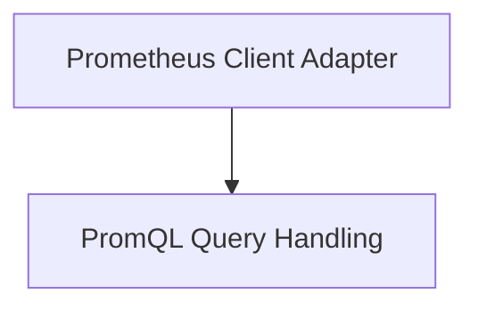

# Metrics Provider Prometheus Module

## Introduction
The `metrics_provider_prometheus` module serves as the primary interface for integrating with Prometheus to retrieve and process metric data. It provides the necessary components to configure a Prometheus client, execute PromQL queries, and handle the structured results. This module is crucial for any part of the system that requires real-time or historical metric analysis from Prometheus.

## Architecture

The `metrics_provider_prometheus` module is logically divided into two main sub-modules, each responsible for a distinct aspect of Prometheus integration:

<!-- DIAGRAM_JSON
{
    "direction": "TD",
    "nodes": [
        {"id": "prometheus_client_adapter", "label": "Prometheus Client Adapter", "type": "module", "link": "prometheus_client_adapter.md"},
        {"id": "promql_query_handling", "label": "PromQL Query Handling", "type": "module", "link": "promql_query_handling.md"}
    ],
    "edges": [
        {"source": "prometheus_client_adapter", "target": "promql_query_handling"}
    ],
    "groups": []
}
-->

## Sub-modules Overview

### [Prometheus Client Adapter](prometheus_client_adapter.md)
This sub-module is responsible for establishing and managing the connection to a Prometheus server. It includes components for configuring the Prometheus client with various parameters such as URL, authentication tokens, timeouts, and connection pooling. It also provides the core provider structure for making queries.

### [PromQL Query Handling](promql_query_handling.md)
This sub-module focuses on the structures and utilities for defining, executing, and interpreting PromQL queries. It encapsulates types for query requests and the structured results returned from Prometheus, facilitating the parsing and processing of metric data.