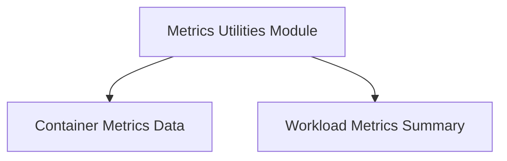

# Metrics Utilities Module Documentation

## Introduction

The `metrics_utilities` module, located within `pkg.task.utils.metrics`, provides core data structures for collecting, storing, and analyzing various metrics related to containers and workloads. It is a fundamental component for tasks that require detailed performance and resource usage insights, enabling features like resource optimization, anomaly detection, and capacity planning.

## Architecture Overview

The `metrics_utilities` module is composed of two primary sub-modules, `container_metrics_data` and `workload_metrics_summary`, which encapsulate different aspects of metrics handling. This modular design ensures clear separation of concerns and facilitates maintainability and extensibility.

<!-- DIAGRAM_JSON
{
    "direction": "TD",
    "nodes": [
        {"id": "metrics_utilities_root", "label": "Metrics Utilities Module", "type": "module", "link": "metrics_utilities.md"},
        {"id": "container_metrics_data", "label": "Container Metrics Data", "type": "module", "link": "container_metrics_data.md"},
        {"id": "workload_metrics_summary", "label": "Workload Metrics Summary", "type": "module", "link": "workload_metrics_summary.md"}
    ],
    "edges": [
        {"source": "metrics_utilities_root", "target": "container_metrics_data"},
        {"source": "metrics_utilities_root", "target": "workload_metrics_summary"}
    ],
    "groups": []
}
-->

## Sub-modules

### [Container Metrics Data](container_metrics_data.md)
This sub-module defines the data structures used to capture detailed performance metrics for individual containers, including CPU and memory usage percentiles, maximum values, and PSI-adjusted usage. It is crucial for understanding the resource consumption patterns at a granular level.

### [Workload Metrics Summary](workload_metrics_summary.md)
This sub-module provides high-level aggregated metrics for workloads, such as the median number of replicas. It offers a summarized view of workload characteristics, complementing the detailed container-level data.

## Integration with other Modules

The `metrics_utilities` module is primarily used by the [task_utilities](task_utilities.md) module, which leverages these metric structures for various task implementations related to resource optimization, monitoring, and recommendation generation. Specifically, tasks within `task_implementations` such as `taskFetchMetrics` or `taskCreateStats` would interact with the data structures defined here to process and store metric information. This module also interacts with `data_types` for broader system-wide metric definitions.