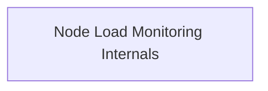

# Node Load Monitoring Core Module

## Introduction
The `node_load_monitoring_core` module is responsible for defining and executing the core logic for monitoring node load within the system. It provides the configuration structure and the task implementation necessary to collect and process node-level metrics.

## Architecture Overview
The `node_load_monitoring_core` module consists of a single sub-module that encapsulates its configuration and execution logic. This module interacts with Kubernetes clients for cluster information and a Prometheus client for metric retrieval.

<!-- DIAGRAM_JSON
{
    "direction": "TD",
    "nodes": [
        {"id": "node_load_monitoring_internals", "label": "Node Load Monitoring Internals", "type": "module", "link": "node_load_monitoring_internals.md"}
    ],
    "edges": [],
    "groups": []
}
-->

## Sub-modules

*   **Node Load Monitoring Internals**: This sub-module defines the configuration parameters and the core task implementation for monitoring node load. It includes the `NodeLoadMonitoringTaskConfig` for task settings and the `NodeLoadMonitoringTask` which orchestrates the monitoring process, leveraging Kubernetes and Prometheus clients. For more details, refer to [Node Load Monitoring Internals](node_load_monitoring_internals.md).
