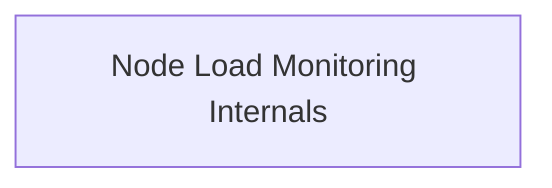

<!-- AUTO_GENERATED_PLACEHOLDER
  reason: LLM did not create .md file for this module
  module_path: task_implementations/node_monitoring_tasks/node_load_monitoring_core/node_load_monitoring_internals
  component_count: 2
  generated_at: 2026-02-03T14:34:07.348722
  TODO: Fix LLM prompt to handle small leaf modules
-->

# Node Load Monitoring Internals

> ⚠️ **Auto-Generated Placeholder**
> This documentation was auto-generated because the LLM failed to create it.
> Module path: `task_implementations/node_monitoring_tasks/node_load_monitoring_core/node_load_monitoring_internals`

Defines the configuration and core implementation for the node load monitoring task, including its dependencies.

## Components

This module contains 2 component(s):

- `pkg.task.taskNodeLoadMonitoring.NodeLoadMonitoringTaskConfig`
- `pkg.task.taskNodeLoadMonitoring.NodeLoadMonitoringTask`

## Structure

---
*Auto-generated placeholder. See sync_issues.json for details.*
