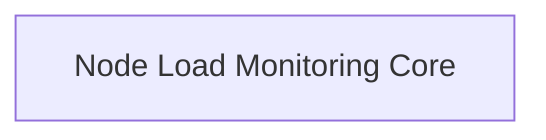

# Node Monitoring Tasks Module

## Introduction
This module is responsible for defining and managing tasks related to node load monitoring within the system. It provides the core structure and configuration for monitoring the health and performance of individual nodes in a cluster.

## Architecture Overview
The `node_monitoring_tasks` module primarily interacts with Kubernetes and Prometheus clients to gather and process node-specific metrics. It is composed of a single sub-module: `node_load_monitoring_core`, which encapsulates the task's configuration and operational logic.

## Sub-modules
*   [Node Load Monitoring Core](node_load_monitoring_core.md): Contains the core components for configuring and executing the node load monitoring task.

<!-- DIAGRAM_JSON
{
    "direction": "TD",
    "nodes": [
        {"id": "node_load_monitoring_core", "label": "Node Load Monitoring Core", "type": "module", "link": "node_load_monitoring_core.md"}
    ],
    "edges": [],
    "groups": []
}
-->

