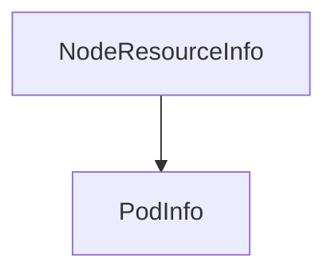

# node_resource_overview

The `node_resource_overview` module provides a foundational data structure, `NodeResourceInfo`, to encapsulate a comprehensive snapshot of a Kubernetes node's resource state. This includes details about its total allocatable and currently requested CPU and memory, as well as a list of all pods running on it. This module is critical for tasks requiring node-level resource analysis, capacity planning, and event monitoring within the system.

## Core Functionality

The primary component of this module is the `NodeResourceInfo` struct, which aggregates vital statistics and configuration for a node.

### `NodeResourceInfo`

```go
type NodeResourceInfo struct {
	AllocatableCPU    float64   `json:"allocatable_cpu"`
	AllocatableMemory float64   `json:"allocatable_memory"`
	RequestedCPU      float64   `json:"requested_cpu"`
	RequestedMemory   float64   `json:"requested_memory"`
	Pods              []PodInfo `json:"pods"`

	NodeType          string `json:"node_type"`
	EventReason       string `json:"event_reason"`
	EventMessage      string `json:"event_message"`
	KarpenterNodePool string `json:"karpenter_node_pool"`
}
```

This struct provides the following fields:

*   **`AllocatableCPU` (float64)**: The total amount of CPU (in cores) that can be allocated to pods on the node.
*   **`AllocatableMemory` (float64)**: The total amount of memory (in bytes or similar unit) that can be allocated to pods on the node.
*   **`RequestedCPU` (float64)**: The total CPU currently requested by all pods running on the node.
*   **`RequestedMemory` (float64)**: The total memory currently requested by all pods running on the node.
*   **`Pods` ([]PodInfo)**: A list of [PodInfo](pod_and_container_details.md) objects, providing detailed information about each pod running on the node.
*   **`NodeType` (string)**: Describes the type of the node (e.g., "spot", "on-demand").
*   **`EventReason` (string)**: A short, machine-readable string indicating the reason for the last significant event on the node.
*   **`EventMessage` (string)**: A human-readable message providing details about the last significant event on the node.
*   **`KarpenterNodePool` (string)**: Identifies the Karpenter node pool to which this node belongs, if applicable.

## Architecture and Component Relationships

The `node_resource_overview` module primarily defines the `NodeResourceInfo` data structure, which is a key data point for various analytical and operational tasks. It depends on the `pod_and_container_details` module for the `PodInfo` type, which describes individual pods on the node. This module is part of the broader [node_statistics](node_statistics.md) utilities within the [task_utilities](task_utilities.md) suite.

<!-- DIAGRAM_JSON
{
    "direction": "TD",
    "nodes": [
        {"id": "node_resource_info", "label": "NodeResourceInfo", "type": "component", "link": null},
        {"id": "pod_info", "label": "PodInfo", "type": "external", "link": "pod_and_container_details.md"}
    ],
    "edges": [
        {"source": "node_resource_info", "target": "pod_info"}
    ],
    "groups": []
}
-->


## How the Module Fits into the Overall System

The `node_resource_overview` module serves as a data model for representing the state of a Kubernetes node. It is utilized by higher-level modules, particularly within [task_utilities](task_utilities.md) and [task_implementations](task_implementations.md), to gather, process, and analyze node-level metrics and events. For instance, tasks focused on node load monitoring or resource optimization would query for `NodeResourceInfo` to make informed decisions. It provides the necessary context for understanding node capacity, identifying over/under-utilized nodes, and reacting to node-related events.
