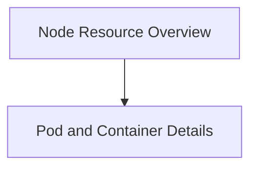

# Node Statistics Module

The `node_statistics` module is responsible for defining and managing data structures related to node and pod resource information within a Kubernetes cluster. It provides a structured way to represent allocatable, requested, and limited CPU and memory resources at both the node and individual container levels.

## Architecture Overview

The module is composed of two primary sub-modules:
- **Node Resource Overview**: Focuses on the overall resource status of a node.
- **Pod and Container Details**: Provides granular resource information for pods and their constituent containers.

These sub-modules work together to offer a comprehensive view of resource utilization and allocation within a Kubernetes node.

<!-- DIAGRAM_JSON
{
    "direction": "TD",
    "nodes": [
        {"id": "node_resource_overview", "label": "Node Resource Overview", "type": "module", "link": "node_resource_overview.md"},
        {"id": "pod_and_container_details", "label": "Pod and Container Details", "type": "module", "link": "pod_and_container_details.md"}
    ],
    "edges": [
        {"source": "node_resource_overview", "target": "pod_and_container_details"}
    ],
    "groups": []
}
-->

## Sub-modules

### [Node Resource Overview](node_resource_overview.md)
This sub-module defines the top-level structure for representing a node's resource information, including its allocatable and requested CPU/memory, along with details about the pods running on it. It primarily uses the `NodeResourceInfo` component.

### [Pod and Container Details](pod_and_container_details.md)
This sub-module provides detailed data structures for individual pods and their containers. It includes components like `PodInfo` which aggregates container-level resources and `ContainerResources` which specifies CPU and memory requests/limits for each container. This level of detail is crucial for understanding resource allocation within specific workloads.