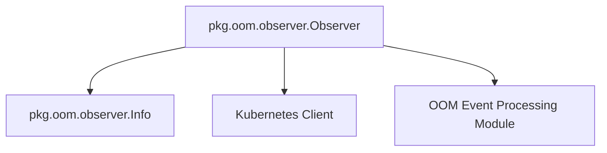

# OOM Event Observer Module

## Introduction

The `oom_event_observer` module is a critical component responsible for actively monitoring and detecting Out-Of-Memory (OOM) events within a Kubernetes cluster. It serves as the frontline observer, capturing detailed information about OOM occurrences to facilitate subsequent analysis and remediation efforts. This module is an integral part of the larger OOM event processing pipeline, feeding raw OOM event data to higher-level modules for further processing.

## Core Functionality

At its core, the `oom_event_observer` module provides mechanisms to observe and capture details of OOM events. It identifies when a container or pod is killed due to exceeding its memory limits and collects relevant contextual information.

### Components

#### `pkg.oom.observer.Info`

This struct defines the data structure used to encapsulate all pertinent information about a detected OOM event. When an OOM event occurs, an instance of `Info` is populated with details such as the affected container, pod, node, namespace, timestamps, and resource limits.

```go
type Info struct {
	ContainerID        string
	NodeName           string
	PodName            string
	Namespace          string
	Timestamp          time.Time
	MemoryLimit        int64
	MemoryRequest      int64
	LastObservedMemory int64
}
```

**Fields:**
- `ContainerID`: Unique identifier of the container that experienced the OOM event.
- `NodeName`: Name of the Kubernetes node where the OOM event occurred.
- `PodName`: Name of the Kubernetes pod where the OOM event occurred.
- `Namespace`: Kubernetes namespace of the affected pod.
- `Timestamp`: The exact time when the OOM event was observed.
- `MemoryLimit`: The memory limit configured for the container (in bytes).
- `MemoryRequest`: The memory request configured for the container (in bytes).
- `LastObservedMemory`: The last observed memory usage of the container before the OOM event (in bytes).

#### `pkg.oom.observer.Observer`

This is the primary component responsible for the actual observation of OOM events. The `Observer` leverages Kubernetes' client-go libraries to watch for pod events and detect OOM conditions.

```go
type Observer struct {
	observedOomsChannel chan Info
	podInformer         cache.SharedIndexInformer
	stopCh              chan struct{}
	kubeClient          kubernetes.Interface
}
```

**Fields:**
- `observedOomsChannel`: A Go channel used to send `Info` structs containing details of detected OOM events to other components or modules for further processing.
- `podInformer`: A `cache.SharedIndexInformer` from Kubernetes client-go, used to efficiently watch for changes in Pod objects within the cluster. This informer helps in identifying pod terminations that are indicative of OOM events.
- `stopCh`: A channel used to signal the `Observer` to stop its operations gracefully.
- `kubeClient`: An interface to the Kubernetes API, providing the `Observer` with the capability to interact with the Kubernetes cluster and fetch necessary information about pods and nodes.

## Architecture and Component Relationships

The `Observer` component is central to this module. It continuously monitors the Kubernetes API for pod events using the `podInformer`. When a relevant event indicating an OOM condition is detected (e.g., a pod being restarted due to an OOMKill reason), the `Observer` collects detailed information about that event, populates an `Info` struct, and then pushes this `Info` onto the `observedOomsChannel`. This channel acts as the primary output of the `oom_event_observer` module, feeding data to upstream processing components.

<!-- DIAGRAM_JSON
{
    "direction": "TD",
    "nodes": [
        {"id": "observer_info", "label": "pkg.oom.observer.Info", "type": "component", "link": null},
        {"id": "observer_observer", "label": "pkg.oom.observer.Observer", "type": "component", "link": null},
        {"id": "kubernetes_client", "label": "Kubernetes Client", "type": "external", "link": null},
        {"id": "oom_event_processing", "label": "OOM Event Processing Module", "type": "external", "link": "oom_event_processing.md"}
    ],
    "edges": [
        {"source": "observer_observer", "target": "observer_info"},
        {"source": "observer_observer", "target": "kubernetes_client"},
        {"source": "observer_observer", "target": "oom_event_processing"}
    ],
    "groups": []
}
-->


## How the Module Fits into the Overall System

The `oom_event_observer` module is positioned at the lowest level of the OOM event processing hierarchy, directly interacting with the Kubernetes API to detect raw OOM events. It acts as a data source for the broader [oom_event_processing](oom_event_processing.md) module.

Upon detection, the OOM event information (via `Info` struct) is passed up the chain to the [oom_event_processing](oom_event_processing.md) module. This parent module is then responsible for orchestrating further actions, which may include:

*   **Persistence**: Storing the OOM event details in a database, potentially leveraging components from the [database_adapters](database_adapters.md) module.
*   **Analysis**: Analyzing the collected OOM events to identify patterns, root causes, or potential resource optimization opportunities.
*   **Action/Trigger**: Initiating tasks or alerts based on the observed OOM events, possibly involving other modules like `cluster_scheduler` or `task_implementations` for remediation.

By providing timely and detailed OOM event data, `oom_event_observer` enables the system to react proactively to resource exhaustion issues, contributing to the overall stability and efficiency of the managed Kubernetes clusters.

