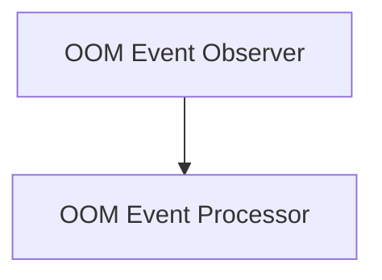

# OOM Event Processing Module

## Introduction

The `oom_event_processing` module is responsible for observing Out-Of-Memory (OOM) events within Kubernetes clusters, collecting relevant information, and processing these events. It forms a critical part of the system for identifying and managing resource-related issues.

## Architecture Overview

The module is composed of two primary sub-modules: the OOM Event Observer and the OOM Event Processor. The Observer actively monitors the cluster for OOM events and gathers detailed information, while the Processor handles the subsequent storage and analysis of these events.

<!-- DIAGRAM_JSON
{
    "direction": "TD",
    "nodes": [
        {"id": "oom_observer", "label": "OOM Event Observer", "type": "module", "link": "oom_observer.md"},
        {"id": "oom_processor", "label": "OOM Event Processor", "type": "module", "link": "oom_processor.md"}
    ],
    "edges": [
        {"source": "oom_observer", "target": "oom_processor"}
    ],
    "groups": []
}
-->

## Sub-modules

### [OOM Event Observer](oom_observer.md)
This sub-module, primarily driven by the `pkg.oom.observer.Observer` component, is tasked with watching Kubernetes for OOM events. It collects crucial details about each event, such as the affected container, pod, node, and memory limits, encapsulated in the `pkg.oom.observer.Info` structure. It acts as the primary data collection point for OOM occurrences.

### [OOM Event Processor](oom_processor.md)

The `oom_event_processor` sub-module, represented by the `pkg.oom.processor.Processor` component, takes the collected OOM event information from the observer. It interacts with the [data_storage_repository](data_storage_repository.md) to persist these events. It also utilizes the `kubernetes.Interface` for interacting with the Kubernetes API, and depends on the [configuration](configuration.md) module for its operational settings.