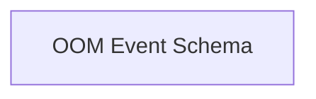

<!-- AUTO_GENERATED_PLACEHOLDER
  reason: LLM did not create .md file for this module
  module_path: database_adapters/database_models/database_schemas/oom_event_schema
  component_count: 1
  generated_at: 2026-02-03T14:34:07.347753
  TODO: Fix LLM prompt to handle small leaf modules
-->

# OOM Event Schema

> ⚠️ **Auto-Generated Placeholder**
> This documentation was auto-generated because the LLM failed to create it.
> Module path: `database_adapters/database_models/database_schemas/oom_event_schema`

Defines the database schema for storing Out-Of-Memory (OOM) events, including details like cluster ID, container ID, pod name, and timestamps.

## Components

This module contains 1 component(s):

- `pkg.adapters.database.models.OOMEvent`

## Structure

---
*Auto-generated placeholder. See sync_issues.json for details.*
