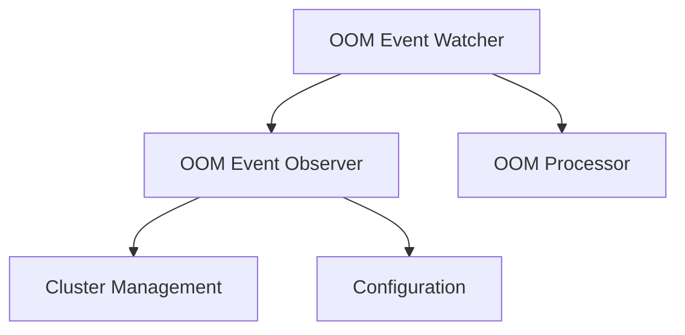

# OOM Event Watcher Module

## Introduction and Purpose
The `oom_event_watcher` module is a critical component responsible for actively monitoring a Kubernetes cluster for Out-Of-Memory (OOM) events. It acts as the primary sensor for OOM incidents, collecting relevant data about these events and making this information available for further processing. This module provides the foundational data necessary for understanding and addressing OOM issues within the cluster.

## Architecture Overview
The `oom_event_watcher` module operates within the broader `oom_event_processing` system. It primarily leverages Kubernetes informers to watch for pod events and detect OOM occurrences. The detected OOM events, enriched with relevant contextual information, are then passed on for further analysis and action by other modules, such as the `oom_processor`.

The module interacts with the `cluster_management` module to obtain a Kubernetes client for API interactions and relies on the `configuration` module for its operational settings.

<!-- DIAGRAM_JSON
{
    "direction": "TD",
    "nodes": [
        {"id": "oom_event_watcher", "label": "OOM Event Watcher", "type": "module"},
        {"id": "oom_event_observer", "label": "OOM Event Observer", "type": "module", "link": "oom_event_observer.md"},
        {"id": "cluster_management", "label": "Cluster Management", "type": "module", "link": "cluster_management.md"},
        {"id": "configuration", "label": "Configuration", "type": "module", "link": "configuration.md"},
        {"id": "oom_processor", "label": "OOM Processor", "type": "module", "link": "oom_processor.md"}
    ],
    "edges": [
        {"source": "oom_event_watcher", "target": "oom_event_observer"},
        {"source": "oom_event_observer", "target": "cluster_management"},
        {"source": "oom_event_observer", "target": "configuration"},
        {"source": "oom_event_watcher", "target": "oom_processor"}
    ],
    "groups": []
}
-->

## High-Level Functionality

### OOM Event Observer
The `oom_event_observer` sub-module is responsible for the core task of watching for and collecting OOM event data. It utilizes Kubernetes API watchers to detect OOM events and then extracts relevant information such as container ID, node name, pod name, namespace, timestamp, and memory limits/requests. This collected information is encapsulated in an `Info` struct and then sent through a channel for further processing.
For more detailed information, refer to the [oom_event_observer documentation](oom_event_observer.md).
