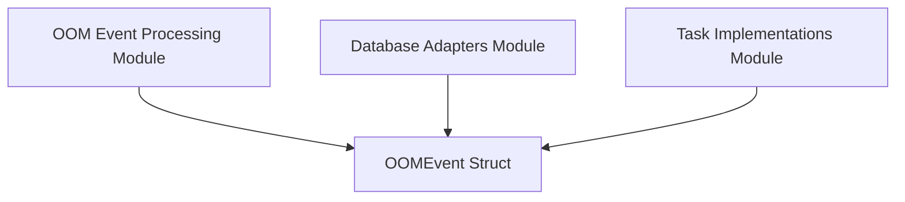

# oom_events Module Documentation

## Introduction

The `oom_events` module defines the fundamental data structure for Out Of Memory (OOM) events within the system. It provides a standardized representation for OOM incidents, encapsulating all relevant information such as cluster, container, pod, and node identifiers, along with memory usage details and timestamps. This module serves as a core data model, facilitating consistent handling and analysis of OOM events across various components of the system.

## Core Functionality

The primary component of this module is the `OOMEvent` struct. This struct is a Go language definition that specifies the fields required to describe an OOM event comprehensively. It includes:

*   **ID:** Unique identifier for the OOM event.
*   **ClusterID:** Identifier of the cluster where the OOM event occurred.
*   **ContainerID:** Identifier of the container involved in the OOM event.
*   **PodName:** Name of the Kubernetes pod where the container was running.
*   **NodeName:** Name of the node where the OOM event took place.
*   **Namespace:** Kubernetes namespace of the affected pod.
*   **Timestamp:** The exact time when the OOM event was observed.
*   **MemoryLimit:** The configured memory limit for the container.
*   **MemoryRequest:** The configured memory request for the container.
*   **LastObservedMemory:** The last recorded memory usage of the container before the OOM.
*   **CreatedAt:** Timestamp for when the event record was created.
*   **UpdatedAt:** Timestamp for when the event record was last updated.

This structured approach ensures that all necessary information for debugging, analysis, and automated remediation of OOM issues is readily available and consistently formatted.

## Architecture and Component Relationships

The `oom_events` module is a leaf module within the `data_types` module tree, specifically nested under `stats_types`. As such, it primarily acts as a data definition provider. Other modules across the system depend on this module to understand, store, process, and act upon OOM event data.

The `OOMEvent` struct serves as a critical data contract for:
*   **OOM Event Processing:** Modules responsible for observing and processing OOM events rely on this structure to ingest and interpret incoming data.
*   **Database Storage:** Database adapters use this structure to persist OOM event records, ensuring historical data is retained for analysis and reporting.
*   **Task Implementations:** Various tasks, such as cleaning up old OOM events or generating statistics, interact with data conforming to the `OOMEvent` structure.

<!-- DIAGRAM_JSON
{
    "direction": "TD",
    "nodes": [
        {"id": "oom_event_struct", "label": "OOMEvent Struct", "type": "component", "link": null},
        {"id": "oom_event_processing", "label": "OOM Event Processing Module", "type": "external", "link": "oom_event_processing.md"},
        {"id": "database_adapters", "label": "Database Adapters Module", "type": "external", "link": "database_adapters.md"},
        {"id": "task_implementations", "label": "Task Implementations Module", "type": "external", "link": "task_implementations.md"}
    ],
    "edges": [
        {"source": "oom_event_processing", "target": "oom_event_struct"},
        {"source": "database_adapters", "target": "oom_event_struct"},
        {"source": "task_implementations", "target": "oom_event_struct"}
    ],
    "groups": []
}
-->

## How the Module Fits into the Overall System

The `oom_events` module is foundational for any functionality related to Out Of Memory event management. It provides the essential blueprint for OOM event data, ensuring that all parts of the system communicate about OOMs using a common language.

Specifically:
*   It is used by the `oom_event_processing` module to collect and enrich OOM event data from the cluster.
*   The `database_adapters` module leverages this definition for storing OOM events in a persistent database.
*   Modules like `task_implementations` (e.g., `CleanupOOMEventsTask`) consume this data to perform automated actions or generate insights.

By centralizing the definition of an `OOMEvent`, this module promotes data consistency, reduces potential errors in data interpretation, and simplifies the development of features that interact with OOM event information. It forms a crucial part of the system's ability to monitor, diagnose, and mitigate memory-related issues in containerized environments.
