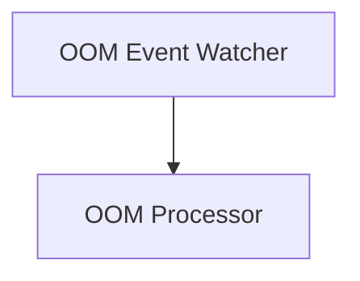

# OOM Observer Module

## Introduction

The `oom_observer` module is responsible for detecting Out-Of-Memory (OOM) events within a Kubernetes cluster. It actively monitors pod and container activities to identify when an OOM event occurs, collects critical information about the event, and then makes this information available for further processing by other system components, such as the `oom_processor` module.

Its primary goal is to provide timely and accurate data regarding OOM kills, enabling the system to react appropriately, for instance, by triggering recommendations for resource adjustments or generating statistics.

## Architecture Overview

The `oom_observer` module is a core component of the OOM event processing pipeline. It works by observing the Kubernetes API for events related to pod and container lifecycle, specifically looking for signals that indicate an OOM termination. The collected information includes details such as container ID, node name, pod name, namespace, timestamp of the event, and memory limits/requests at the time of the OOM.

This module primarily interacts with the Kubernetes API to gather the necessary data. It produces `Info` objects which encapsulate all relevant details of an observed OOM event. These events are then channeled to subsequent processing stages.

<!-- DIAGRAM_JSON
{
    "direction": "TD",
    "nodes": [
        {"id": "oom_event_watcher", "label": "OOM Event Watcher", "type": "module", "link": "oom_event_watcher.md"}
    ],
    "edges": [
        {"source": "oom_event_watcher", "target": "oom_processor", "label": "Sends OOM Events"}
    ],
    "groups": []
}
-->

## Sub-modules

- **[OOM Event Watcher](oom_event_watcher.md)**: This sub-module is responsible for actively monitoring the Kubernetes cluster for OOM events, collecting detailed information, and signaling these events for further action.