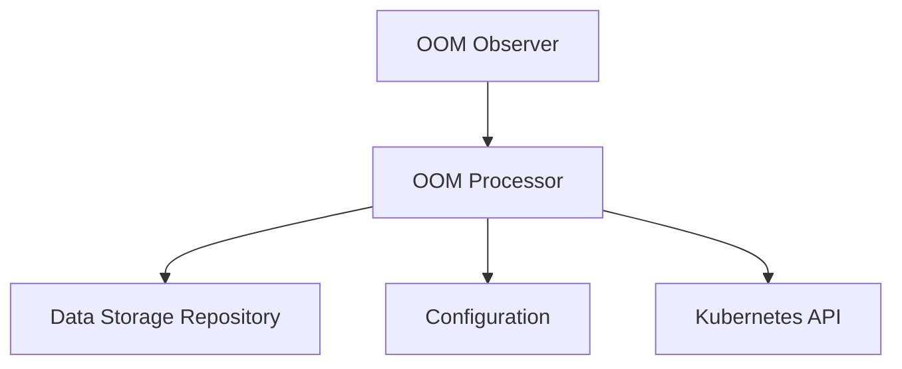

# oom_processor Module Documentation

## Introduction
The `oom_processor` module is a crucial component within the OOM event processing system, responsible for handling and reacting to Out-Of-Memory (OOM) events detected in the cluster. It provides the core logic for processing these events, interacting with various system components to ensure proper handling and potential remediation.

## Core Functionality
The primary responsibility of the `oom_processor` module is to process Out-Of-Memory (OOM) events. This involves:

*   **OOM Event Consumption:** Receiving OOM event notifications, typically from the [oom_observer](oom_observer.md) module.
*   **Data Persistence:** Utilizing the [data_storage_repository](data_storage_repository.md) to store details of OOM events, associated metadata, and potentially updated statistics.
*   **Configuration Access:** Accessing the system-wide [configuration](configuration.md) to determine processing rules, thresholds, or specific integration parameters for handling OOM events.
*   **Kubernetes Interaction:** Interacting with the Kubernetes API to gather detailed information about the affected pods and containers, and potentially to trigger actions or apply resource adjustments based on the processed event.

## Architecture and Component Relationships

The `oom_processor` module is built around a single core component, `Processor`, which orchestrates the OOM event handling logic.

### Core Component: `pkg.oom.processor.Processor`
The `Processor` struct is the central component responsible for managing the OOM event processing workflow. It encapsulates the necessary dependencies to perform its tasks.

```go
type Processor struct {
	storage    *storage.Storage
	kubeClient kubernetes.Interface
	clusterID  string
	stopCh     chan struct{}
	cfg        *config.Config
}
```

*   `storage *storage.Storage`: A pointer to an instance of the `Storage` interface, provided by the [data_storage_repository](data_storage_repository.md) module. This enables the `Processor` to interact with the underlying database for storing and retrieving OOM event data.
*   `kubeClient kubernetes.Interface`: An interface to the Kubernetes client, allowing the `Processor` to communicate with the Kubernetes API server to query cluster state, such as pod and container details, or to initiate cluster modifications.
*   `clusterID string`: A unique identifier for the cluster where the OOM events are being processed.
*   `stopCh chan struct{}`: A channel used for graceful shutdown and signaling the termination of processing routines.
*   `cfg *config.Config`: A pointer to the system's [configuration](configuration.md), which provides runtime parameters and settings relevant to OOM event processing.

## How the module fits into the overall system

The `oom_processor` module operates as a critical processing unit within the broader OOM event management system. It acts as the consumer of OOM events detected by the [oom_observer](oom_observer.md) module. Upon receiving an event, the `oom_processor` evaluates the situation based on system [configuration](configuration.md), retrieves or updates relevant data using the [data_storage_repository](data_storage_repository.md), and interacts with the Kubernetes API to understand the context of the OOM event and potentially trigger automated responses or recommendations. This module is essential for closing the loop between OOM event detection and actionable insights or system adjustments.

<!-- DIAGRAM_JSON
{
    "direction": "TD",
    "nodes": [
        {"id": "processor", "label": "OOM Processor", "type": "component", "link": null},
        {"id": "storage", "label": "Data Storage Repository", "type": "external", "link": "data_storage_repository.md"},
        {"id": "configuration", "label": "Configuration", "type": "external", "link": "configuration.md"},
        {"id": "kubernetes", "label": "Kubernetes API", "type": "external", "link": null},
        {"id": "oom_observer", "label": "OOM Observer", "type": "external", "link": "oom_observer.md"}
    ],
    "edges": [
        {"source": "oom_observer", "target": "processor"},
        {"source": "processor", "target": "storage"},
        {"source": "processor", "target": "configuration"},
        {"source": "processor", "target": "kubernetes"}
    ],
    "groups": []
}
-->
