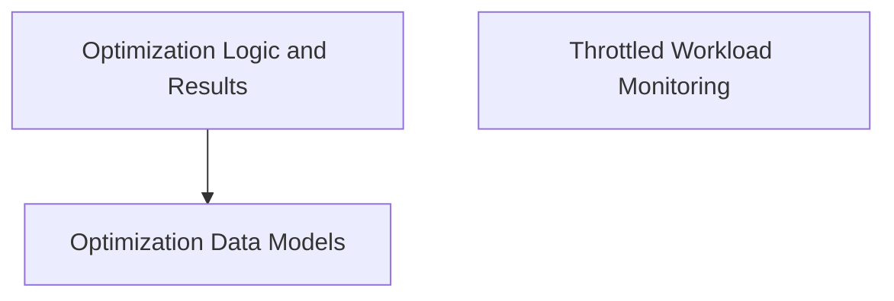

# Optimization and Metrics Module

This module provides core data structures and interfaces for defining, executing, and evaluating resource optimization strategies within a Kubernetes environment. It encompasses data models for nodes, pods, and containers, mechanisms for generating recommendations, and structures for reporting optimization results and identifying throttled workloads.

## Architecture Overview

The `optimization_and_metrics` module is structured into several sub-modules, each handling a specific aspect of resource optimization and metrics collection. These sub-modules interact to facilitate the overall optimization process.

<!-- DIAGRAM_JSON
{
    "direction": "TD",
    "nodes": [
        {"id": "optimization_data_models", "label": "Optimization Data Models", "type": "module", "link": "optimization_data_models.md"},
        {"id": "optimization_logic_and_results", "label": "Optimization Logic and Results", "type": "module", "link": "optimization_logic_and_results.md"},
        {"id": "throttled_workload_monitoring", "label": "Throttled Workload Monitoring", "type": "module", "link": "throttled_workload_monitoring.md"}
    ],
    "edges": [
        {"source": "optimization_logic_and_results", "target": "optimization_data_models"}
    ],
    "groups": []
}
-->

## Sub-modules

### [Optimization Data Models](optimization_data_models.md)
This sub-module defines data structures for representing node optimization data, non-optimizable pod information, and pod-level metrics, crucial for the optimization process.

### [Optimization Logic and Results](optimization_logic_and_results.md)
This sub-module provides interfaces for defining various optimization strategies and structures to encapsulate the recommendations and overall outcomes of the optimization process.

### [Throttled Workload Monitoring](throttled_workload_monitoring.md)
This sub-module is responsible for managing data related to the identification and tracking of workloads that are currently experiencing throttling issues, which is vital for performance analysis and optimization efforts.
