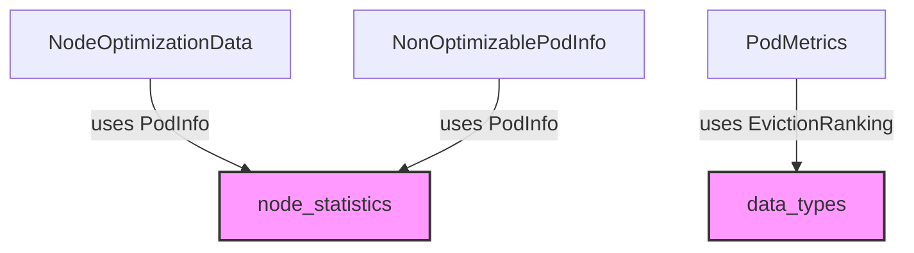

# optimization_data_models

The `optimization_data_models` module defines crucial data structures used throughout the system for representing and exchanging information related to resource optimization at both the node and pod levels. These models facilitate the collection, analysis, and application of optimization recommendations, ensuring efficient resource utilization within the Kubernetes clusters.

## Module Purpose and Core Functionality

This module serves as the central hub for data models essential to the resource optimization process. Its core functionalities include:
*   **Node-level Optimization Data Aggregation**: Providing a structure (`NodeOptimizationData`) to consolidate information about a specific node's resources and the pods running on it, enabling holistic node-level analysis.
*   **Identification of Non-Optimizable Pods**: Defining a structure (`NonOptimizablePodInfo`) to detail pods that are excluded from optimization efforts, along with the reasons and their current resource profiles.
*   **Pod-level Metric Representation**: Offering a model (`PodMetrics`) to encapsulate various calculated metrics and recommendations for individual pods, which are instrumental in making informed optimization decisions, including potential eviction rankings.

These data models are fundamental for tasks such as metric fetching, workload analysis, and the application of resource recommendations within the system.

## Architecture and Component Relationships

The `optimization_data_models` module consists of three primary data structures that interact with external modules to gather comprehensive optimization-related data.

<!-- DIAGRAM_JSON
{
    "direction": "TD",
    "nodes": [
        {"id": "node_optimization_data", "label": "NodeOptimizationData", "type": "component", "link": null},
        {"id": "non_optimizable_pod_info", "label": "NonOptimizablePodInfo", "type": "component", "link": null},
        {"id": "pod_metrics", "label": "PodMetrics", "type": "component", "link": null},
        {"id": "node_statistics", "label": "node_statistics", "type": "external", "link": "node_statistics.md"},
        {"id": "data_types", "label": "data_types", "type": "external", "link": "data_types.md"}
    ],
    "edges": [
        {"source": "node_optimization_data", "target": "node_statistics", "label": "uses PodInfo"},
        {"source": "non_optimizable_pod_info", "target": "node_statistics", "label": "uses PodInfo"},
        {"source": "pod_metrics", "target": "data_types", "label": "uses EvictionRanking"}
    ],
    "groups": []
}
-->


### Component Descriptions

*   **`NodeOptimizationData`**: This Go struct aggregates optimization-relevant data for a specific node. It includes the node's name, its allocatable CPU and memory resources, and a slice of `PodInfo` objects, each detailing a pod running on that node. This comprehensive view aids in making node-level resource allocation decisions.
    ```go
    type NodeOptimizationData struct {
        NodeName          string
        AllocatableCPU    float64
        AllocatableMemory float64
        PodInfos          []PodInfo // from node_statistics
    }
    ```

*   **`NonOptimizablePodInfo`**: This Go struct is used to identify and provide details about pods that are intentionally excluded from optimization. It includes the pod's name, namespace, a nested `PodInfo` (from `node_statistics`), its current CPU and memory usage, and the number of containers it comprises. This allows for clear tracking and reporting of unoptimizable workloads.
    ```go
    type NonOptimizablePodInfo struct {
        PodName        string  `json:"pod_name"`
        PodInfo        PodInfo `json:"pod_info"` // from node_statistics
        PodNamespace   string  `json:"pod_namespace"`
        CurrentCPU     float64 `json:"current_cpu"`
        CurrentMemory  float64 `json:"current_memory"`
        ContainerCount int     `json:"container_count"`
    }
    ```

*   **`PodMetrics`**: This Go struct encapsulates various calculated metrics pertinent to a single pod for optimization purposes. It includes the total recommended CPU and memory, maximum remaining CPU and memory after recommendations, and an `EvictionRanking` (from `data_types`) which indicates the pod's priority for potential eviction. These metrics are vital for fine-tuning pod resource requests and limits.
    ```go
    type PodMetrics struct {
        TotalRecommendedCPU    float64
        TotalRecommendedMemory float64
        MaxRestCPU             float64
        MaxRestMemory          float64
        EvictionRanking        types.EvictionRanking // from data_types
    }
    ```

## Integration with the Overall System

The `optimization_data_models` module plays a pivotal role in the system by providing the standardized data structures that enable various components to communicate and process optimization-related information effectively.

*   **Task Implementations**: Modules like `task_implementations` (specifically tasks such as `ApplyRecommendationTask`, `CreateStatsTask`, and `FetchMetricsTask`) heavily rely on these data models to ingest, process, and output optimization data. For instance, `NodeOptimizationData` would be used by tasks responsible for analyzing node-wide resource utilization, while `PodMetrics` would guide tasks that adjust individual pod resources.
*   **Prediction and Types**: As part of the broader `prediction_and_types` module, these models integrate with other types to form a comprehensive understanding of workload behavior and optimization strategies. They are essential for linking raw metrics with actionable recommendations.
*   **Data Storage and Reporting**: The data models facilitate the consistent storage of optimization results in databases (e.g., via `database_adapters`) and the generation of reports or API responses (e.g., via `api_handlers`) that inform users about the state of their cluster's resource optimization.

By centralizing these critical data definitions, the `optimization_data_models` module ensures data consistency and interoperability across the entire optimization ecosystem.