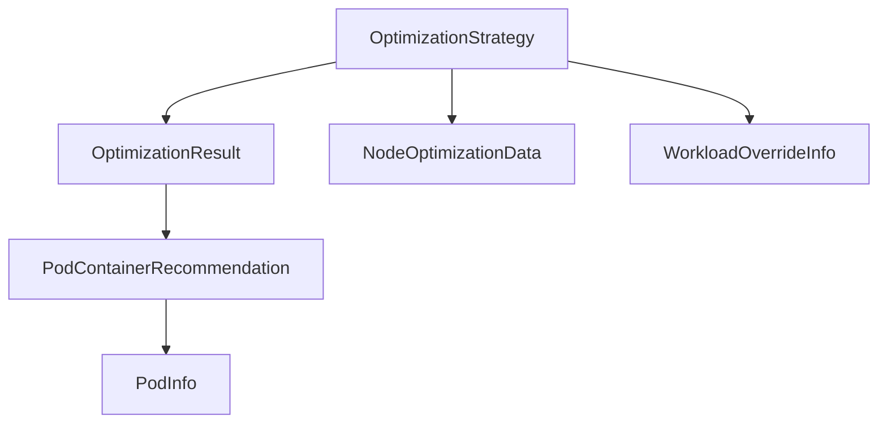

# optimization_logic_and_results

The `optimization_logic_and_results` module defines the core interfaces and data structures used for implementing and representing the outcomes of resource optimization strategies within the system. It provides the blueprint for how optimization algorithms are designed and how their recommendations are structured.

## Core Functionality

This module primarily focuses on two key aspects:

1.  **Defining Optimization Strategies**: Through the `OptimizationStrategy` interface, it sets the contract for any component that aims to implement a resource optimization algorithm.
2.  **Structuring Optimization Results**: It provides concrete data structures, `PodContainerRecommendation` and `OptimizationResult`, to capture the specific resource adjustments and their overall impact following an optimization run.

### OptimizationStrategy

```go
type OptimizationStrategy interface {
        GetName() string
        OptimizeNode(kubeClient *kubernetes.Clientset, overridesMap map[string]*types.WorkloadOverrideInfo, data NodeOptimizationData) (OptimizationResult, error)
}
```

This interface serves as the blueprint for any optimization algorithm within the system. Implementations of this interface are responsible for analyzing node-level data and workload overrides to determine optimal resource allocations. The `OptimizeNode` method performs the core optimization logic, taking a Kubernetes client, workload overrides, and node optimization data as input, and returning an `OptimizationResult`.

### PodContainerRecommendation

```go
type PodContainerRecommendation struct {
        PodInfo       PodInfo `json:"pod_info"`
        ContainerName string  `json:"container_name"`
        CPU           float64 `json:"recommended_cpu"`
        Memory        float64 `json:"recommended_memory"`
        Evict         bool    `json:"evict"`
}
```

`PodContainerRecommendation` is a granular data structure that encapsulates the recommended resource changes for a single container within a specific pod. It includes the target container's name, recommended CPU and memory values, and a flag indicating if the pod should be evicted.

### OptimizationResult

```go
type OptimizationResult struct {
        PodContainerRecommendations []PodContainerRecommendation `json:"pod_container_recommendations"`
        MaxRestCPU                  float64                      `json:"max_rest"`
        MaxRestMemory               float64                      `json:"max_rest_memory"`
}
```

The `OptimizationResult` structure aggregates all individual `PodContainerRecommendation`s generated by an `OptimizationStrategy`. It also provides a summary of the maximum remaining CPU and memory on the node after applying the recommendations, which can be crucial for subsequent scheduling decisions or further optimizations.

## Architecture and Component Relationships

This module serves as a foundational layer for defining and structuring optimization logic and its outcomes. It depends on various external data structures to perform its functions and define its results.

<!-- DIAGRAM_JSON
{
    "direction": "TD",
    "nodes": [
        {"id": "optimization_strategy", "label": "OptimizationStrategy", "type": "component", "link": null},
        {"id": "pod_container_recommendation", "label": "PodContainerRecommendation", "type": "component", "link": null},
        {"id": "optimization_result", "label": "OptimizationResult", "type": "component", "link": null},
        {"id": "node_optimization_data", "label": "NodeOptimizationData", "type": "external", "link": "optimization_data_models.md"},
        {"id": "workload_override_info", "label": "WorkloadOverrideInfo", "type": "external", "link": "data_types.md"},
        {"id": "pod_info", "label": "PodInfo", "type": "external", "link": "node_statistics.md"}
    ],
    "edges": [
        {"source": "optimization_strategy", "target": "node_optimization_data"},
        {"source": "optimization_strategy", "target": "workload_override_info"},
        {"source": "optimization_strategy", "target": "optimization_result"},
        {"source": "optimization_result", "target": "pod_container_recommendation"},
        {"source": "pod_container_recommendation", "target": "pod_info"}
    ],
    "groups": []
}
-->



-   **OptimizationStrategy**: Utilizes `NodeOptimizationData` for current node and workload metrics from the [optimization_data_models](optimization_data_models.md) module, and `WorkloadOverrideInfo` from the [data_types](data_types.md) module to inform its optimization decisions. It produces an `OptimizationResult`.
-   **OptimizationResult**: Contains a list of `PodContainerRecommendation` objects, representing the specific changes to be applied.
-   **PodContainerRecommendation**: Each recommendation references `PodInfo` from the [node_statistics](node_statistics.md) module to identify the target pod.

## How it Fits into the Overall System

The `optimization_logic_and_results` module is critical to the system's ability to intelligently adjust resource allocations. It provides the foundational types and interfaces that allow different optimization algorithms to be plugged into the system, such as those implemented as part of specific [task_implementations](task_implementations.md).

It plays a central role in the workflow of tasks that aim to optimize resource usage, by defining the input and output structures for these optimization processes. For instance, tasks that apply recommendations would consume `OptimizationResult` objects to make actual changes to the cluster. The data structures defined here are used across various components, ensuring consistency in how optimization data is processed and communicated throughout the system.