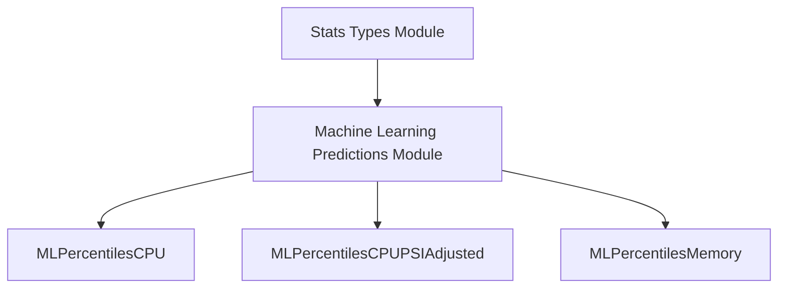

# Percentile Predictions Module

## Introduction
This module defines data structures for machine learning-based percentile predictions related to CPU, CPU with PSI (Pressure Stall Information) adjustment, and memory usage. These structures are integral for representing predicted resource usage statistics within the system, particularly for resource optimization and recommendation processes.

## Comprehensive Documentation

The `percentile_predictions` module encapsulates the data models used to store percentile-based predictions for various resource metrics. These predictions are typically generated by machine learning models and are crucial for understanding workload behavior and deriving resource recommendations.

### Core Components:

*   **`MLPercentilesCPUPSIAdjusted`**: This structure holds percentile predictions for CPU utilization, specifically adjusted for PSI (Pressure Stall Information). It includes median, P90, P95, and P99 values.
    ```go
    type MLPercentilesCPUPSIAdjusted struct {
    	Median float64 `json:"median"`
    	P90    float64 `json:"p90"`
    	P95    float64 `json:"p95"`
    	P99    float64 `json:"p99"`
    }
    ```

*   **`MLPercentilesCPU`**: Similar to `MLPercentilesCPUPSIAdjusted`, this structure defines percentile predictions for raw CPU utilization, also including median, P90, P95, and P99 values.
    ```go
    type MLPercentilesCPU struct {
    	Median float64 `json:"median"`
    	P90    float64 `json:"p90"`
    	P95    float64 `json:"p95"`
    	P99    float64 `json:"p99"`
    }
    ```

*   **`MLPercentilesMemory`**: This structure provides percentile predictions for memory usage, encompassing median, P90, P95, and P99 values.
    ```go
    type MLPercentilesMemory struct {
    	Median float64 `json:"median"`
    	P90    float64 `json:"p90"`
    	P95    float64 `json:"p95"`
    	P99    float64 `json:"p99"`
    }
    ```

These data structures are primarily used by the [machine_learning_predictions.md](machine_learning_predictions.md) module to store and communicate detailed statistical insights derived from workload analysis. They contribute to the broader [stats_types.md](stats_types.md) module, which defines various statistical data types used throughout the system.

### Architecture and Component Relationships:

The `percentile_predictions` module serves as a foundational data definition layer for statistical predictions. Its components are consumed by higher-level modules that perform analysis and generate recommendations.

<!-- DIAGRAM_JSON
{
    "direction": "TD",
    "nodes": [
        {"id": "ml_percentiles_cpu", "label": "MLPercentilesCPU", "type": "component", "link": null},
        {"id": "ml_percentiles_cpu_psi_adjusted", "label": "MLPercentilesCPUPSIAdjusted", "type": "component", "link": null},
        {"id": "ml_percentiles_memory", "label": "MLPercentilesMemory", "type": "component", "link": null},
        {"id": "machine_learning_predictions", "label": "Machine Learning Predictions Module", "type": "external", "link": "machine_learning_predictions.md"},
        {"id": "stats_types", "label": "Stats Types Module", "type": "external", "link": "stats_types.md"}
    ],
    "edges": [
        {"source": "machine_learning_predictions", "target": "ml_percentiles_cpu"},
        {"source": "machine_learning_predictions", "target": "ml_percentiles_cpu_psi_adjusted"},
        {"source": "machine_learning_predictions", "target": "ml_percentiles_memory"},
        {"source": "stats_types", "target": "machine_learning_predictions"}
    ],
    "groups": []
}
-->


### How the module fits into the overall system:

This module provides the standardized data structures for representing machine learning-generated percentile predictions. These predictions are critical inputs for various components within the system, especially those involved in:

*   **Resource Recommendation**: The percentile values (e.g., P90, P95, P99) help in determining appropriate resource requests and limits for containers, ensuring stable performance while optimizing resource usage.
*   **Performance Analysis**: By providing predicted resource usage at different percentiles, the system can better understand workload behavior and identify potential bottlenecks or areas for optimization.

It acts as a data definition submodule within [stats_types.md](stats_types.md), specializing in the representation of prediction outputs from machine learning models, which are then utilized by the [machine_learning_predictions.md](machine_learning_predictions.md) module for further processing or storage.