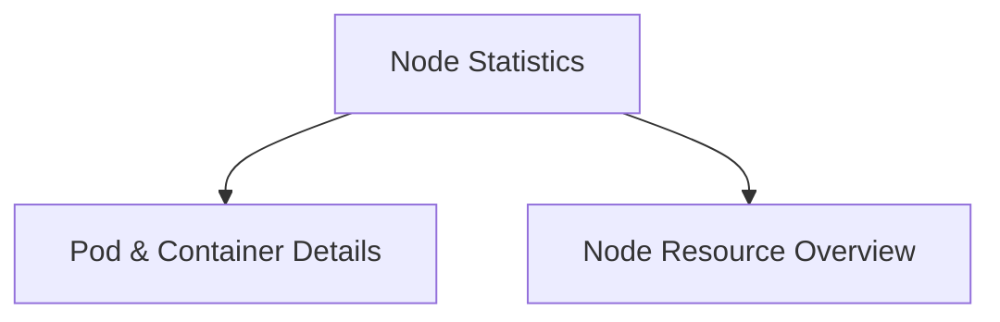

# Pod and Container Details Module

## Introduction and Purpose
The `pod_and_container_details` module is a fundamental component within the broader [node_statistics.md](node_statistics.md) module. Its primary purpose is to define and manage data structures that capture comprehensive details about Kubernetes pods and their individual containers, with a specific focus on resource requests and limits. This module provides the granular information necessary for monitoring, analyzing, and optimizing resource allocation within a Kubernetes cluster.

## Architecture Overview
This module encapsulates two core data structures: `PodInfo` and `ContainerResources`.

`PodInfo` represents a Kubernetes pod, aggregating essential metadata such as namespace, name, workload kind, and overall resource requests and limits for the pod. It also contains a list of `ContainerResources` objects, establishing a direct compositional relationship between a pod and its constituent containers.

`ContainerResources` defines the CPU and memory requests and limits for a single container. This allows for detailed insight into the resource provisioning at the individual container level within a pod.

The `pod_and_container_details` module interacts closely with other parts of the system, particularly its parent [node_statistics.md](node_statistics.md) module and its sibling [node_resource_overview.md](node_resource_overview.md), which provides node-level resource information. Together, these modules form a complete picture of resource utilization across the cluster, feeding into higher-level [task_utilities.md](task_utilities.md) for tasks like optimization and recommendation generation.

<!-- DIAGRAM_JSON
{
    "direction": "TD",
    "nodes": [
        {"id": "node_statistics", "label": "Node Statistics", "type": "module", "link": "node_statistics.md"},
        {"id": "pod_and_container_details", "label": "Pod & Container Details", "type": "module", "link": "pod_and_container_details.md"},
        {"id": "node_resource_overview", "label": "Node Resource Overview", "type": "module", "link": "node_resource_overview.md"}
    ],
    "edges": [
        {"source": "node_statistics", "target": "pod_and_container_details"},
        {"source": "node_statistics", "target": "node_resource_overview"}
    ],
    "groups": []
}
-->

## Core Functionality

### `PodInfo`
- **Purpose**: Represents comprehensive information about a Kubernetes pod.
- **Details**:
    - Stores metadata such as `Namespace`, `Name`, `WorkloadKind`, and `WorkloadName`.
    - Aggregates `RequestedCPU`, `RequestedMemory`, `LimitCPU`, and `LimitMemory` across all containers within the pod.
    - Includes a flag for `ContinuousOptimization` and an optional `Stats` field (refer to [data_types.md](data_types.md) for `WorkloadStat` details).
    - Contains a slice of `ContainerResources` objects, linking to the resource details of each individual container in the pod.

### `ContainerResources`
- **Purpose**: Defines the resource requests and limits for a single container within a pod.
- **Details**:
    - Specifies the `Name` of the container.
    - Records `CPURequest`, `CPULimit`, `MemoryRequest`, and `MemoryLimit` for that container.
    - These values are crucial for understanding the declared resource needs and boundaries of individual container workloads.