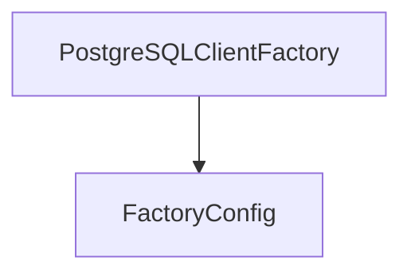

# postgres_client_factory

The `postgres_client_factory` module is responsible for providing a concrete implementation for creating PostgreSQL database clients within the system. It leverages a factory pattern to encapsulate the logic of client instantiation, ensuring a consistent and configurable approach to database connections.

## Architecture and Component Relationships

The `postgres_client_factory` module contains the `PostgreSQLClientFactory` component, which is a specialized factory for PostgreSQL clients. It depends on `FactoryConfig` to configure the client creation process.

<!-- DIAGRAM_JSON
{
    "direction": "TD",
    "nodes": [
        {"id": "postgresql_client_factory", "label": "PostgreSQLClientFactory", "type": "component", "link": null},
        {"id": "factory_config", "label": "FactoryConfig", "type": "external", "link": "client_configuration.md"}
    ],
    "edges": [
        {"source": "postgresql_client_factory", "target": "factory_config"}
    ],
    "groups": []
}
-->


### PostgreSQLClientFactory

The `PostgreSQLClientFactory` (core component: `pkg.adapters.database.clients.postgres.PostgreSQLClientFactory`) struct defines the factory for creating PostgreSQL database clients. It holds the configuration required for establishing a connection.

```go
type PostgreSQLClientFactory struct {
	config FactoryConfig
}
```

- **`config`**: An instance of `FactoryConfig` which provides the necessary parameters for configuring the PostgreSQL client. This configuration is defined in the [client_configuration](client_configuration.md) module.

## How the module fits into the overall system

The `postgres_client_factory` module is a crucial part of the `database_adapters` system, specifically within the `database_clients` and `database_implementations` sub-modules. It provides the concrete implementation for creating PostgreSQL clients, which are then utilized by the `database_core` module to interact with PostgreSQL databases. This modular design allows for easy swapping or extension of database client implementations without affecting other parts of the system. It ensures that the application can connect and interact with PostgreSQL databases efficiently and reliably.
