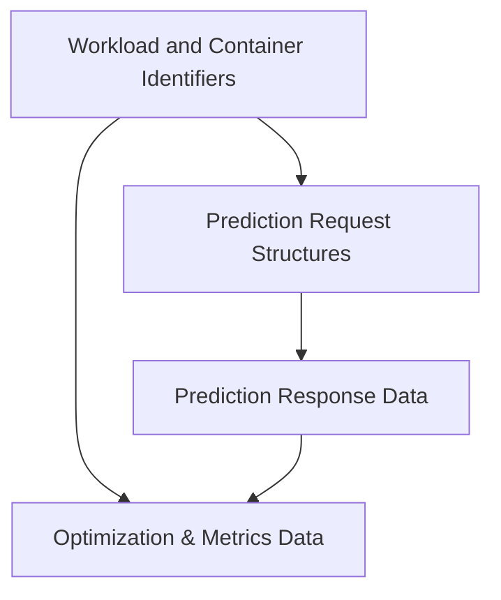

# Prediction and Types Module

## Introduction
The `prediction_and_types` module, residing within `pkg.task.utils`, provides fundamental data structures and interfaces for time series prediction, workload optimization, and robust identification of Kubernetes resources like pods, containers, and workloads. It underpins the system's ability to forecast resource needs and apply intelligent optimization strategies.

## Architecture Overview
This module is structured into several key sub-modules, each focusing on a specific aspect of data modeling related to predictions and system types. These sub-modules facilitate clear separation of concerns and efficient data handling throughout the application.

<!-- DIAGRAM_JSON
{
    "direction": "TD",
    "nodes": [
        {"id": "prediction_requests", "label": "Prediction Request Structures", "type": "module", "link": "prediction_requests.md"},
        {"id": "prediction_responses", "label": "Prediction Response Data", "type": "module", "link": "prediction_responses.md"},
        {"id": "optimization_and_metrics", "label": "Optimization & Metrics Data", "type": "module", "link": "optimization_and_metrics.md"},
        {"id": "workload_and_container_identifiers", "label": "Workload and Container Identifiers", "type": "module", "link": "workload_and_container_identifiers.md"}
    ],
    "edges": [
        {"source": "prediction_requests", "target": "prediction_responses"},
        {"source": "workload_and_container_identifiers", "target": "prediction_requests"},
        {"source": "workload_and_container_identifiers", "target": "optimization_and_metrics"},
        {"source": "prediction_responses", "target": "optimization_and_metrics"}
    ],
    "groups": []
}
-->

## Sub-modules
*   **[Prediction Request Structures](prediction_requests.md)**: Defines data structures used for initiating time series prediction requests.
*   **[Prediction Response Data](prediction_responses.md)**: Contains data structures for various types of prediction results and statistics.
*   **[Optimization & Metrics Data](optimization_and_metrics.md)**: Structures for node optimization data, pod metrics, and optimization strategies.
*   **[Workload and Container Identifiers](workload_and_container_identifiers.md)**: Defines key structures for uniquely identifying workloads, pods, and containers.
