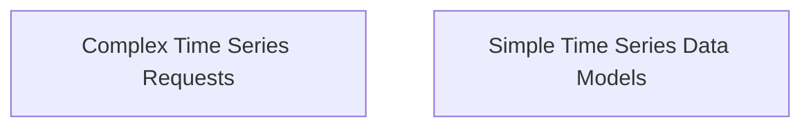

# Prediction Requests Module

## Introduction
The `prediction_requests` module is responsible for defining the data structures used to formulate requests for time series predictions within the system. It provides distinct models for simple and complex prediction scenarios, ensuring flexibility in how forecasting data is structured and communicated.

## Architecture Overview

<!-- DIAGRAM_JSON
{
    "direction": "TD",
    "nodes": [
        {"id": "complex_time_series_requests", "label": "Complex Time Series Requests", "type": "module", "link": "complex_time_series_requests.md"},
        {"id": "simple_time_series_data_models", "label": "Simple Time Series Data Models", "type": "module", "link": "simple_time_series_data_models.md"}
    ],
    "edges": [],
    "groups": []
}
-->

## Sub-modules

### [Complex Time Series Requests](complex_time_series_requests.md)
This sub-module defines the `TimeSeriesRequest` structure, which is used for more intricate time series prediction requests. It includes provisions for detailed time series data and a specific forecast horizon.

### [Simple Time Series Data Models](simple_time_series_data_models.md)
This sub-module provides simplified data structures, `SimpleTimeSeriesRequest` and `SimpleTimeSeriesData`, for basic time series prediction requests. It focuses on clearly defined entities, timestamps, and corresponding values.