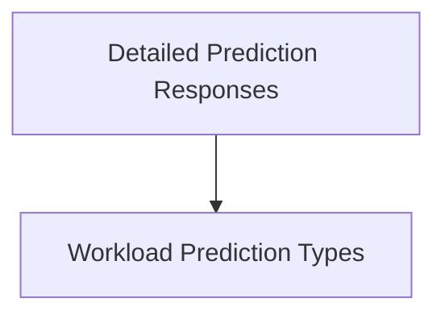

# Prediction Responses Module

## Introduction
This module defines the data structures used for various prediction responses within the system. It encompasses types for general workload predictions, simple entity-specific predictions, and comprehensive statistical prediction responses.

## Architecture
The `prediction_responses` module is structured into the following sub-modules:
- `workload_prediction_types`: Defines the fundamental structure for workload predictions.
- `detailed_prediction_responses`: Manages specific prediction response formats, including simple and statistical representations.

<!-- DIAGRAM_JSON
{
    "direction": "TD",
    "nodes": [
        {"id": "workload_prediction_types", "label": "Workload Prediction Types", "type": "module", "link": "workload_prediction_types.md"},
        {"id": "detailed_prediction_responses", "label": "Detailed Prediction Responses", "type": "module", "link": "detailed_prediction_responses.md"}
    ],
    "edges": [
        {"source": "detailed_prediction_responses", "target": "workload_prediction_types", "label": "utilizes"}
    ],
    "groups": []
}
-->

## Sub-module Functionality
- **Workload Prediction Types:** This sub-module (documented in [workload_prediction_types.md](workload_prediction_types.md)) provides the basic data structure (`WorkloadPrediction`) for representing predicted values like median, P90, P95, and P99 for workloads.
- **Detailed Prediction Responses:** This sub-module (documented in [detailed_prediction_responses.md](detailed_prediction_responses.md)) defines richer response formats, including `SimplePredictionResponse` for straightforward predictions and `PredictionStatsResponse` for more complex statistical outputs.
