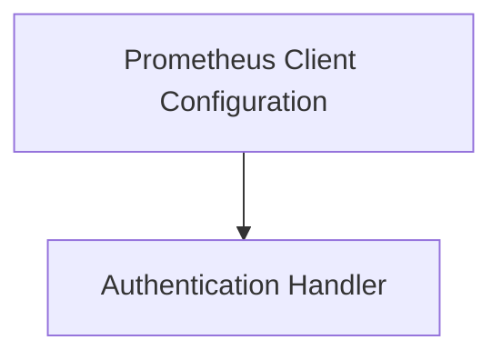

# Prometheus Client Adapter Module Documentation

## Introduction
The `prometheus_client_adapter` module provides the core functionality for interacting with a Prometheus server, enabling the application to fetch metrics and perform queries. It encapsulates the Prometheus client configuration and provides a robust provider for metric retrieval.

## Architecture Overview
This module is responsible for configuring and establishing connections to a Prometheus instance, as well as handling the authentication mechanisms required for secure communication. It is a child module of `metrics_provider_prometheus` and works in conjunction with `promql_query_handling` to execute queries.

<!-- DIAGRAM_JSON
{
    "direction": "TD",
    "nodes": [
        {"id": "prometheus_client_configuration", "label": "Prometheus Client Configuration", "type": "module", "link": "prometheus_client_configuration.md"},
        {"id": "authentication_handler", "label": "Authentication Handler", "type": "module", "link": "authentication_handler.md"}
    ],
    "edges": [
        {"source": "prometheus_client_configuration", "target": "authentication_handler"}
    ],
    "groups": []
}
-->

## Sub-modules

### [Prometheus Client Configuration](prometheus_client_configuration.md)
This sub-module is responsible for defining the configuration parameters for connecting to a Prometheus server and managing the `PrometheusProvider` instance. It includes settings for URL, timeouts, connection pooling, and retry mechanisms.

### [Authentication Handler](authentication_handler.md)
This sub-module provides the necessary utilities for handling authentication when making requests to Prometheus, specifically by integrating Bearer Token authentication into the HTTP transport layer.