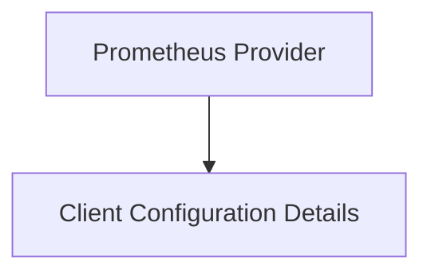

# Prometheus Client Configuration

## Introduction and Purpose

The `prometheus_client_configuration` module is a crucial part of the metrics collection and analysis system. It defines the structure for configuring the Prometheus client and provides the core Prometheus data provider, enabling the application to connect to a Prometheus instance, fetch metrics, and execute PromQL queries. This module ensures robust and configurable interaction with Prometheus, supporting various deployment scenarios and operational requirements.

## Architecture Overview

This module is composed of two primary sub-modules: `client_configuration_details` and `prometheus_provider`. The `client_configuration_details` sub-module encapsulates all the settings required to establish and manage a connection with a Prometheus server, while the `prometheus_provider` sub-module utilizes this configuration to create and manage the Prometheus client, facilitating metric queries and data retrieval.

<!-- DIAGRAM_JSON
{
    "direction": "TD",
    "nodes": [
        {"id": "prometheus_provider", "label": "Prometheus Provider", "type": "module", "link": "prometheus_provider.md"},
        {"id": "client_configuration_details", "label": "Client Configuration Details", "type": "module", "link": "client_configuration_details.md"}
    ],
    "edges": [
        {"source": "prometheus_provider", "target": "client_configuration_details"}
    ],
    "groups": []
}
-->

## High-Level Functionality

### Prometheus Provider
The `prometheus_provider` sub-module (`prometheus_provider.md`) is responsible for providing an interface to interact with the Prometheus API. It leverages the client configuration to establish connections and manage concurrent queries, ensuring efficient and reliable data retrieval from Prometheus.

### Client Configuration Details
The `client_configuration_details` sub-module (`client_configuration_details.md`) defines the comprehensive set of parameters needed to configure the Prometheus client. This includes connection URLs, authentication tokens, various timeouts, and concurrency settings for queries, allowing for fine-grained control over Prometheus interactions.

