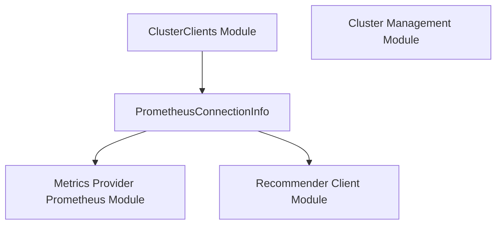

# `prometheus_connection_info` Module Documentation

## Introduction

The `prometheus_connection_info` module is a fundamental component within the `cluster_management` system, specifically nested under the `cluster_clients` module. Its primary purpose is to define the structure for storing essential connection details required to interact with a Prometheus instance. This module ensures that other parts of the system can consistently and securely connect to Prometheus for metrics collection and analysis.

## Architecture and Component Relationships

This module contains a single, crucial data structure: `PrometheusConnectionInfo`. This structure is utilized by components that need to establish a connection to a Prometheus server, such as the `metrics_provider_prometheus` for fetching raw metrics, and potentially by the `recommender_client` for proxying Prometheus requests.

<!-- DIAGRAM_JSON
{
    "direction": "TD",
    "nodes": [
        {"id": "prometheus_connection_info", "label": "PrometheusConnectionInfo", "type": "component", "link": null},
        {"id": "cluster_clients", "label": "ClusterClients Module", "type": "external", "link": "cluster_clients.md"},
        {"id": "cluster_management", "label": "Cluster Management Module", "type": "external", "link": "cluster_management.md"},
        {"id": "metrics_provider_prometheus", "label": "Metrics Provider Prometheus Module", "type": "external", "link": "metrics_provider_prometheus.md"},
        {"id": "recommender_client", "label": "Recommender Client Module", "type": "external", "link": "recommender_client.md"}
    ],
    "edges": [
        {"source": "cluster_clients", "target": "prometheus_connection_info"},
        {"source": "prometheus_connection_info", "target": "metrics_provider_prometheus"},
        {"source": "prometheus_connection_info", "target": "recommender_client"}
    ],
    "groups": []
}
-->



### Core Components

#### `PrometheusConnectionInfo`

**File:** `pkg/cluster/manager.go`

```go
type PrometheusConnectionInfo struct {
        URL         string
        BearerToken string
}
```

This Go struct defines the necessary information to connect to a Prometheus instance. It includes:

*   `URL`: The endpoint URL of the Prometheus server.
*   `BearerToken`: An optional bearer token used for authentication with the Prometheus server. This allows secure access to Prometheus APIs.

## How the Module Fits into the Overall System

The `prometheus_connection_info` module serves as a crucial data carrier for Prometheus connectivity. It is instantiated and managed by its parent module, `cluster_clients`, which is responsible for aggregating connection details for various cluster-related services. These connection details, including `PrometheusConnectionInfo`, are then passed to other parts of the system that require interaction with Prometheus.

Specifically, modules like `metrics_provider_prometheus` would consume this `PrometheusConnectionInfo` to initialize its own Prometheus client and fetch metrics. The `recommender_client` might also leverage this information, especially if it needs to proxy requests to Prometheus or directly interact with it to gather data for recommendations.

By centralizing the definition of Prometheus connection parameters, this module promotes consistency and simplifies configuration management across the entire system for all Prometheus-related operations.
