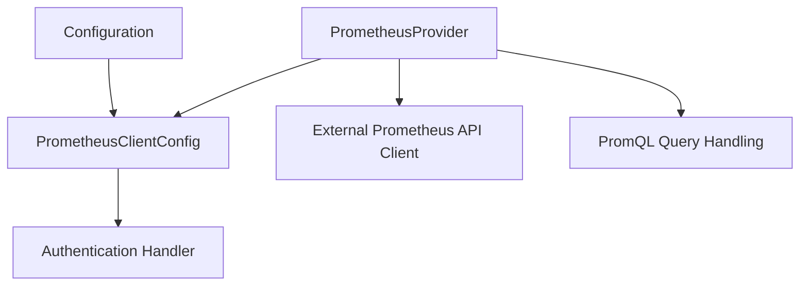

# `prometheus_provider` Module Documentation

## Introduction

The `prometheus_provider` module is a leaf module within the `metrics_provider_prometheus` ecosystem, specifically responsible for providing the concrete implementation of the Prometheus client. It encapsulates the core logic for connecting to a Prometheus server, managing its configuration, and preparing for executing queries. This module acts as the direct interface to a Prometheus instance, allowing other parts of the system to fetch metrics and monitor system performance.

## Architecture and Core Functionality

This module's primary component is the `PrometheusProvider` struct, which serves as the central point for interacting with a Prometheus instance. It manages the underlying Prometheus API client, holds the client-specific configuration, and implements mechanisms to control query concurrency.

### Core Component: `PrometheusProvider`

```go
type PrometheusProvider struct {
	client          v1.API
	config          *PrometheusClientConfig
	querySemaphores sync.Map
}
```

-   **`client v1.API`**: This field holds an instance of the Prometheus API client, likely from a third-party library (e.g., `github.com/prometheus/client_golang/api`). It is responsible for making actual HTTP requests to the Prometheus server and handling responses.
-   **`config *PrometheusClientConfig`**: A pointer to the configuration object for the Prometheus client. This configuration, defined in the [prometheus_client_configuration](prometheus_client_configuration.md) module, dictates connection details, authentication parameters, and other settings necessary for the client to function correctly.
-   **`querySemaphores sync.Map`**: This is used to manage and limit the number of concurrent queries issued to the Prometheus server. By using semaphores, the `PrometheusProvider` prevents overwhelming the Prometheus instance with too many simultaneous requests, thereby ensuring stability and preventing potential rate-limiting issues.

## Module Relationships and System Integration

The `prometheus_provider` module is a crucial adapter that bridges the system's need for metrics with the Prometheus monitoring solution. It is an integral part of the `metrics_provider_prometheus` module, providing the foundational client capabilities.

-   **`prometheus_client_configuration`**: The `PrometheusProvider` directly depends on the `PrometheusClientConfig` from the [prometheus_client_configuration](prometheus_client_configuration.md) module to initialize and configure its internal client.
-   **`promql_query_handling`**: Once configured, the `PrometheusProvider` is responsible for executing PromQL queries, and the data structures for these queries (like `QueryResult` and `ParallelQueryRequest`) are defined in the [promql_query_handling](promql_query_handling.md) module.
-   **`authentication_handler`**: If the Prometheus server requires authentication (e.g., bearer tokens), the `PrometheusProvider` would implicitly leverage the `BearerTokenRoundTripper` defined in the [authentication_handler](authentication_handler.md) module, typically configured through the `PrometheusClientConfig`.
-   **`configuration`**: The overarching system configuration, particularly the `MetricsConfig` within the [configuration](configuration.md) module, provides the high-level settings that ultimately influence the `PrometheusClientConfig`.
-   **`recommender_client` and `cluster_management`**: Modules like [recommender_client](recommender_client.md) and [cluster_management](cluster_management.md) would interact with the broader `metrics_provider_prometheus` to fetch metrics, relying on the `PrometheusProvider` to perform the actual data retrieval from Prometheus.

<!-- DIAGRAM_JSON
{
    "direction": "TD",
    "nodes": [
        {"id": "prometheus_provider", "label": "PrometheusProvider", "type": "component", "link": null},
        {"id": "prometheus_client_configuration", "label": "PrometheusClientConfig", "type": "external", "link": "prometheus_client_configuration.md"},
        {"id": "promql_query_handling", "label": "PromQL Query Handling", "type": "external", "link": "promql_query_handling.md"},
        {"id": "authentication_handler", "label": "Authentication Handler", "type": "external", "link": "authentication_handler.md"},
        {"id": "configuration", "label": "Configuration", "type": "external", "link": "configuration.md"},
        {"id": "external_prom_client", "label": "External Prometheus API Client", "type": "external", "link": null}
    ],
    "edges": [
        {"source": "prometheus_provider", "target": "prometheus_client_configuration"},
        {"source": "prometheus_provider", "target": "external_prom_client"},
        {"source": "prometheus_provider", "target": "promql_query_handling"},
        {"source": "prometheus_client_configuration", "target": "authentication_handler"},
        {"source": "configuration", "target": "prometheus_client_configuration"}
    ],
    "groups": []
}
-->

