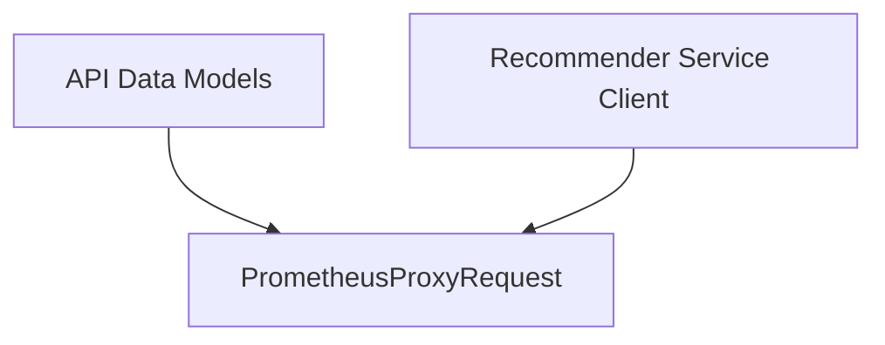

# prometheus_proxy

## Introduction
The `prometheus_proxy` module defines the data structures used for proxying requests to a Prometheus instance. It is a sub-module of the [api_data_models](api_data_models.md) within the [recommender_client](recommender_client.md) module, specifically providing the `PrometheusProxyRequest` structure. This module plays a crucial role in enabling the recommender service to query Prometheus for metrics by encapsulating the necessary details for such proxy requests.

## Core Functionality
The primary component of this module is `PrometheusProxyRequest`, which is a Go struct designed to hold all the information required to forward an HTTP request to a Prometheus endpoint.

### `PrometheusProxyRequest`
This struct models an HTTP request that is intended to be proxied to a Prometheus server. It includes fields for the HTTP method, the specific path on the Prometheus server, any query parameters, custom headers, and the request body.

**Code Snippet:**
```go
type PrometheusProxyRequest struct {
	Method      string
	ProxyPath   string
	QueryParams url.Values
	Headers     map[string]string
	Body        io.Reader
}
```

**Fields:**
*   `Method` (string): The HTTP method to use for the proxied request (e.g., "GET", "POST").
*   `ProxyPath` (string): The specific endpoint path on the Prometheus server to which the request should be forwarded (e.g., `/api/v1/query`).
*   `QueryParams` (url.Values): A map of URL query parameters to be included in the proxied request.
*   `Headers` (map[string]string): A map of HTTP headers to be added to the proxied request.
*   `Body` (io.Reader): The request body, typically used for POST requests.

## Architecture and Component Relationships

The `prometheus_proxy` module, through its `PrometheusProxyRequest` structure, acts as a data contract for interactions with Prometheus via a proxy. It is an integral part of the data models used by the [recommender_client](recommender_client.md) to formulate requests for metric data.

<!-- DIAGRAM_JSON
{
    "direction": "TD",
    "nodes": [
        {"id": "prometheus_proxy_request", "label": "PrometheusProxyRequest", "type": "component", "link": null},
        {"id": "recommender_service_client", "label": "Recommender Service Client", "type": "external", "link": "recommender_client.md"},
        {"id": "api_data_models", "label": "API Data Models", "type": "external", "link": "api_data_models.md"}
    ],
    "edges": [
        {"source": "api_data_models", "target": "prometheus_proxy_request"},
        {"source": "recommender_service_client", "target": "prometheus_proxy_request"}
    ],
    "groups": []
}
-->


## How the Module Fits into the Overall System
This module provides the standardized structure for requests made to Prometheus from the recommender service. When the [recommender_client](recommender_client.md) needs to fetch metrics or execute PromQL queries, it constructs a `PrometheusProxyRequest` object and dispatches it through a proxy mechanism. This ensures that the recommender service can interact with various Prometheus instances consistently, without directly managing the low-level HTTP communication with Prometheus, thereby promoting modularity and maintainability. It is a fundamental data model for any Prometheus-related interactions initiated by the recommender system.
