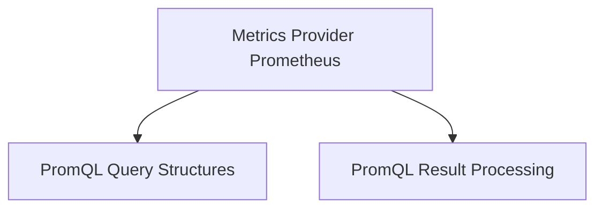

# PromQL Query Handling Module

## Introduction

The `promql_query_handling` module is responsible for defining the structures and facilitating the processing of PromQL (Prometheus Query Language) queries within the system. It encapsulates the data models for executing queries, representing their results, and managing internal data structures for processing those results.

## Architecture Overview

The module is structured into two main sub-modules: `promql_query_structures` and `promql_result_processing`. It functions as a core component for the `metrics_provider_prometheus` module, which relies on these definitions to interact with Prometheus and retrieve metric data.

<!-- DIAGRAM_JSON
{
    "direction": "TD",
    "nodes": [
        {"id": "metrics_provider_prometheus", "label": "Metrics Provider Prometheus", "type": "external", "link": "metrics_provider_prometheus.md"},
        {"id": "promql_query_structures", "label": "PromQL Query Structures", "type": "module", "link": "promql_query_structures.md"},
        {"id": "promql_result_processing", "label": "PromQL Result Processing", "type": "module", "link": "promql_result_processing.md"}
    ],
    "edges": [
        {"source": "metrics_provider_prometheus", "target": "promql_query_structures"},
        {"source": "metrics_provider_prometheus", "target": "promql_result_processing"}
    ],
    "groups": []
}
-->

## High-Level Functionality

### [PromQL Query Structures](promql_query_structures.md)
This sub-module defines the fundamental data structures used for constructing PromQL queries and encapsulating their results. It includes types like `QueryResult` for parsed query responses and `ParallelQueryRequest` for managing concurrent query executions.

### [PromQL Result Processing](promql_result_processing.md)
This sub-module focuses on the internal handling and organization of query results, particularly `namespaceResult`, which helps in processing metrics collected for specific namespaces. This is crucial for aggregating and making sense of the raw data obtained from Prometheus.
