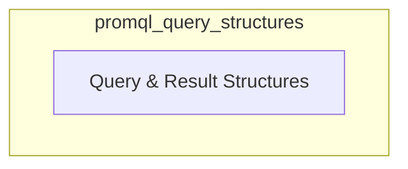

# PromQL Query Structures

The `promql_query_structures` module is a crucial component within the `metrics_provider_prometheus.promql_query_handling` system. Its primary purpose is to define the fundamental data structures used for constructing PromQL queries and encapsulating their results. This module ensures consistency and type safety when interacting with the Prometheus metrics provider, facilitating reliable data retrieval and processing.

## Architecture Overview

The `promql_query_structures` module is a focused unit that provides the core data definitions for PromQL interactions. It directly supports the `promql_query_handling` module by offering the necessary structures for executing and interpreting PromQL queries. It does not have external dependencies within the context of data structure definitions but is utilized by modules that perform actual PromQL query execution and result processing.

<!-- DIAGRAM_JSON
{
    "direction": "TD",
    "nodes": [
        {"id": "query_definitions", "label": "Query & Result Structures", "type": "module", "link": "query_definitions.md"}
    ],
    "edges": [],
    "groups": []
}
-->

## Sub-modules

### [Query & Result Structures](query_definitions.md)
This sub-module, defined in `query_definitions.md`, focuses on the precise data structures essential for PromQL interactions. It includes definitions for:
- `QueryResult`: A structure to hold the result of a PromQL query, including the actual `model.Value`, any `Warnings`, and potential `Error` information, along with a `QueryID`.
- `ParallelQueryRequest`: A structure representing an individual request within a parallel query operation, containing a `QueryID` and the `Query` string itself.

This separation ensures clarity and maintainability of the data contracts between different parts of the system interacting with PromQL.