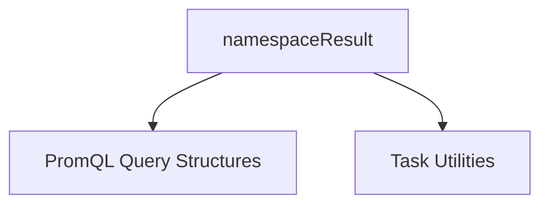

# promql_result_processing

The `promql_result_processing` module is a critical component within the Prometheus metrics provider, focusing on the efficient processing and organization of results obtained from PromQL queries. It specifically handles the structuring of query outcomes, particularly by namespace, to facilitate further analysis and caching of metrics.

### Purpose and Core Functionality

This module's primary responsibility is to provide a structured way to encapsulate the results of PromQL queries. It defines the `namespaceResult` structure, which serves as a container for processed metrics data, categorized by Kubernetes namespace. This approach significantly aids in optimizing data retrieval and access for subsequent operations.

The core component of this module is:

*   **`namespaceResult`**: This structure is designed to hold the processed data from a PromQL query for a specific namespace. It includes:
    *   `namespace`: A string identifying the Kubernetes namespace to which the results belong.
    *   `cache`: A map (`utils.WorkloadKeyVsContainerMetrics`) storing container-level metrics, indexed by a workload key. This allows for quick lookup and retrieval of metrics for individual containers within a workload.
    *   `workloadKeyVsWorkloadMetrics`: A map (`utils.WorkloadKeyVsWorkloadMetrics`) storing workload-level metrics, indexed by a workload key. This provides aggregated metrics for entire workloads.
    *   `error`: An error field to capture any issues encountered during the processing or retrieval of metrics for the given namespace.

The module enables effective caching of both container and workload metrics, which is crucial for performance in systems that frequently query Prometheus for resource utilization and other operational data.

### Architecture and Component Relationships

The `promql_result_processing` module is a leaf module within the `promql_query_handling` and `metrics_provider_prometheus` hierarchy. It depends on `task_utilities` for the definition of workload and container metrics types used in its caching mechanisms. It processes the results of queries that would be structured and managed by the `promql_query_structures` module.

<!-- DIAGRAM_JSON
{
    "direction": "TD",
    "nodes": [
        {"id": "namespace_result", "label": "namespaceResult", "type": "component", "link": null},
        {"id": "promql_query_structures", "label": "PromQL Query Structures", "type": "external", "link": "promql_query_structures.md"},
        {"id": "task_utilities", "label": "Task Utilities", "type": "external", "link": "task_utilities.md"}
    ],
    "edges": [
        {"source": "namespace_result", "target": "promql_query_structures"},
        {"source": "namespace_result", "target": "task_utilities"}
    ],
    "groups": []
}
-->

### How the Module Fits into the Overall System

The `promql_result_processing` module plays a vital role in the `metrics_provider_prometheus` component by transforming raw query results into a more usable and organized format. It acts as an intermediary, taking the output from PromQL queries (potentially initiated or structured by `promql_query_handling` or `promql_query_structures`) and processing it into cached, namespace-specific metric data. This processed data can then be consumed by other parts of the system, such as `task_implementations` or other analytics components that require structured workload and container metrics. Its caching capabilities are essential for reducing redundant Prometheus queries and improving the overall responsiveness and efficiency of the system.
