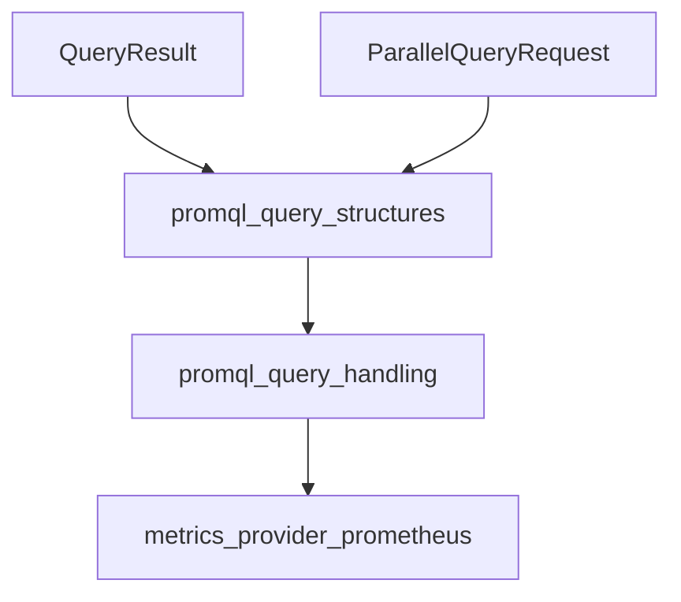

# query_definitions Module Documentation

## Introduction
The `query_definitions` module defines the fundamental data structures used for handling Prometheus query results and requests within the system.

## Purpose and Core Functionality
This module serves as the foundational layer for structuring Prometheus-related data. It provides the `QueryResult` type, which encapsulates the raw result from a Prometheus query, including any warnings or errors. Additionally, it defines the `ParallelQueryRequest` type, enabling the system to define and manage individual queries within a larger parallel execution context.

### Core Components

#### `QueryResult`
```go
type QueryResult struct {
        Result   model.Value
        Warnings []string
        Error    error
        QueryID  string
}
```
This structure holds the outcome of a single Prometheus query, including the actual `model.Value` result, any `Warnings` encountered, an `Error` if the query failed, and a `QueryID` for identification.

#### `ParallelQueryRequest`
```go
type ParallelQueryRequest struct {
        QueryID string
        Query   string
}
```
This structure represents an individual query to be executed as part of a parallel query operation. It includes a `QueryID` for tracking and the `Query` string itself.

## Architecture and Component Relationships
The `query_definitions` module is a leaf module nested within the `promql_query_structures` module, which in turn is part of the broader `promql_query_handling` module, located under the `metrics_provider_prometheus` adapter. It defines essential data types that are consumed by these higher-level modules to construct, execute, and process Prometheus queries.

<!-- DIAGRAM_JSON
{
    "direction": "TD",
    "nodes": [
        {"id": "query_result", "label": "QueryResult", "type": "component", "link": null},
        {"id": "parallel_query_request", "label": "ParallelQueryRequest", "type": "component", "link": null},
        {"id": "promql_query_structures", "label": "promql_query_structures", "type": "external", "link": "promql_query_structures.md"},
        {"id": "promql_query_handling", "label": "promql_query_handling", "type": "external", "link": "promql_query_handling.md"},
        {"id": "metrics_provider_prometheus", "label": "metrics_provider_prometheus", "type": "external", "link": "metrics_provider_prometheus.md"}
    ],
    "edges": [
        {"source": "query_result", "target": "promql_query_structures"},
        {"source": "parallel_query_request", "target": "promql_query_structures"},
        {"source": "promql_query_structures", "target": "promql_query_handling"},
        {"source": "promql_query_handling", "target": "metrics_provider_prometheus"}
    ],
    "groups": []
}
-->
