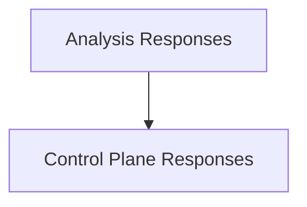

# recommendation_responses Module Documentation

## Introduction

The `recommendation_responses` module defines the core data structures used for responding to requests related to workload recommendations and control plane operations. It encapsulates various response types, including detailed analysis results, summary statistics, killswitch operation outcomes, and workload override information.

## Architecture Overview

The module is structured into two main sub-modules:
- **Analysis Responses**: Focuses on the data structures for presenting the outcomes and summaries of recommendation analyses.
- **Control Plane Responses**: Handles the data structures for responses related to administrative actions such as killswitch operations and managing workload overrides.

These sub-modules work in conjunction to provide a comprehensive set of response types for interacting with the recommendation system.

<!-- DIAGRAM_JSON
{
    "direction": "TD",
    "nodes": [
        {"id": "analysis_responses", "label": "Analysis Responses", "type": "module", "link": "analysis_responses.md"},
        {"id": "control_plane_responses", "label": "Control Plane Responses", "type": "module", "link": "control_plane_responses.md"}
    ],
    "edges": [
        {"source": "analysis_responses", "target": "control_plane_responses", "label": "can influence"}
    ],
    "groups": []
}
-->

## Sub-modules

### [Analysis Responses](analysis_responses.md)
This sub-module defines the data structures for recommendation analysis results and their summaries, providing insights into CPU and memory differences. It includes `RecommendationAnalysisResponse` and `RecommendationSummary`.

### [Control Plane Responses](control_plane_responses.md)
This sub-module manages response structures for control plane operations, including killswitch actions and workload override information. It encompasses `KillswitchResponse` and `WorkloadOverrideInfo`.