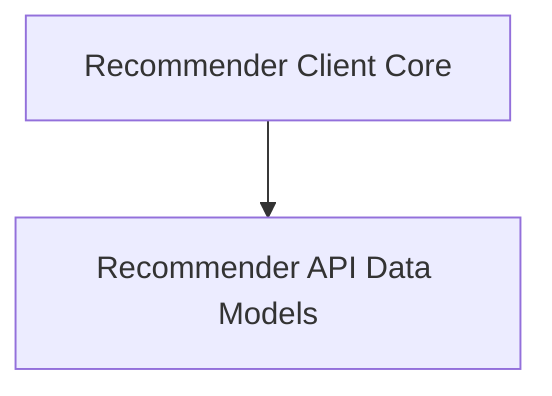

# Recommender Client Module

## Introduction and Purpose

The `recommender_client` module provides the necessary client functionality to interact with the recommender service. It enables other parts of the system to make requests for cluster information, health checks, and proxy Prometheus queries, facilitating communication and data exchange with the external recommendation engine.

## Architecture Overview

The `recommender_client` module is composed of two main sub-modules: `client_core` which handles the client's configuration and structure, and `api_data_models` which defines the data structures for API communication.

<!-- DIAGRAM_JSON
{
    "direction": "TD",
    "nodes": [
        {"id": "client_core", "label": "Recommender Client Core", "type": "module", "link": "client_core.md"},
        {"id": "api_data_models", "label": "Recommender API Data Models", "type": "module", "link": "api_data_models.md"}
    ],
    "edges": [
        {"source": "client_core", "target": "api_data_models"}
    ],
    "groups": []
}
-->

## High-Level Functionality

### [Recommender Client Core](client_core.md)
This sub-module encapsulates the core logic for instantiating and configuring the client that communicates with the recommender service. It includes the `RecommenderServiceClient` which is responsible for making API calls, and `ClientConfig` which defines the necessary parameters for client setup (host, credentials, timeout, etc.).

### [Recommender API Data Models](api_data_models.md)
This sub-module defines the various data structures used for request and response serialization when interacting with the recommender service's API. This includes models like `ClustersResponse` for cluster listings, `HealthResponse` for service health, `RootResponse` for basic API information, `ClusterInfo` for details about individual clusters, and `PrometheusProxyRequest` for structuring proxied Prometheus queries.