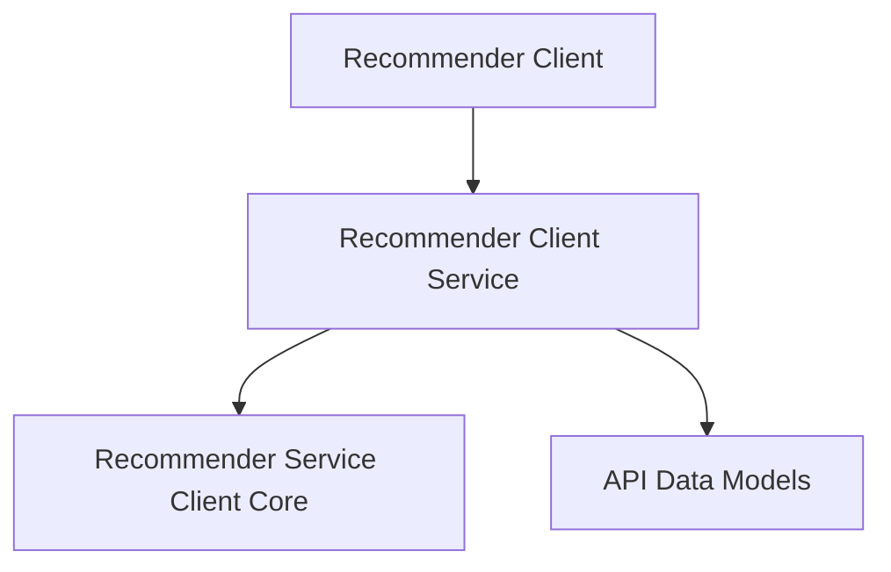

# Recommender Client Service Module Documentation

## Introduction

The `recommender_client_service` module provides the core client implementation and configuration for interacting with an external Recommender Service. This module is essential for any part of the system that needs to query the recommendation engine, fetch cluster information, or proxy Prometheus requests. It encapsulates the network communication logic and the necessary authentication mechanisms.

## Architecture Overview

The `recommender_client_service` module is a child of the `recommender_client` module, focusing specifically on the client-side interaction with the recommender service. It relies on internal components for configuration and the parent module for broader client functionalities, while also interacting with data models defined in the `api_data_models` sibling module.

<!-- DIAGRAM_JSON
{
    "direction": "TD",
    "nodes": [
        {"id": "recommender_client", "label": "Recommender Client", "type": "module", "link": "recommender_client.md"},
        {"id": "recommender_client_service", "label": "Recommender Client Service", "type": "module", "link": "recommender_client_service.md"},
        {"id": "service_client_core", "label": "Recommender Service Client Core", "type": "module", "link": "service_client_core.md"},
        {"id": "api_data_models", "label": "API Data Models", "type": "module", "link": "api_data_models.md"}
    ],
    "edges": [
        {"source": "recommender_client", "target": "recommender_client_service"},
        {"source": "recommender_client_service", "target": "service_client_core"},
        {"source": "recommender_client_service", "target": "api_data_models"}
    ],
    "groups": []
}
-->

## Sub-modules

### Recommender Service Client Core
This sub-module defines the fundamental structure of the `RecommenderServiceClient` and its associated `ClientConfig`. It encapsulates the necessary details for establishing connections and authenticating with the Recommender Service.
For more details, refer to the [service_client_core.md](service_client_core.md) documentation.

## Relationships to Other Modules

*   **[recommender_client.md](recommender_client.md)**: As a child module, `recommender_client_service` is a specialized component within the broader `recommender_client` functionality.
*   **[api_data_models.md](api_data_models.md)**: This module utilizes data structures and response formats defined in `api_data_models` for its communication with the recommender service.
