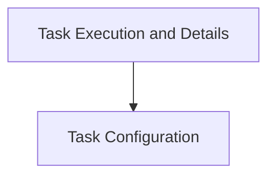

# Resource Modification Tasks

## Introduction
The `resource_modification_tasks` module is responsible for defining and configuring tasks related to modifying resources, specifically CPU resources, within a Kubernetes cluster. This module facilitates automated adjustments to container CPU limits based on predefined configurations.

## Architecture Overview
The `resource_modification_tasks` module is composed of two main sub-modules:
- `task_execution`: Handles the core logic of the resource modification task and defines the structure for container modifications.
- `task_configuration`: Manages the configuration settings required for the resource modification task.

These sub-modules interact to ensure that resource modification tasks are properly configured and executed within the system.

<!-- DIAGRAM_JSON
{
    "direction": "TD",
    "nodes": [
        {"id": "task_execution", "label": "Task Execution and Details", "type": "module", "link": "task_execution.md"},
        {"id": "task_configuration", "label": "Task Configuration", "type": "module", "link": "task_configuration.md"}
    ],
    "edges": [
        {"source": "task_execution", "target": "task_configuration"}
    ],
    "groups": []
}
-->

## Sub-modules

### Task Execution and Details ([task_execution.md](task_execution.md))
This sub-module defines the `ModifyEqualCPUResourcesTask`, which is the core component responsible for carrying out the CPU resource modification. It also includes `containerModification`, a structure detailing how a container's CPU limit should be altered.

### Task Configuration ([task_configuration.md](task_configuration.md))
This sub-module manages the essential configuration parameters for the `ModifyEqualCPUResourcesTask`. It includes settings such as the task's name, whether it is enabled, its execution schedule, the cluster ID it targets, and whether it has write authorization to the cluster.
