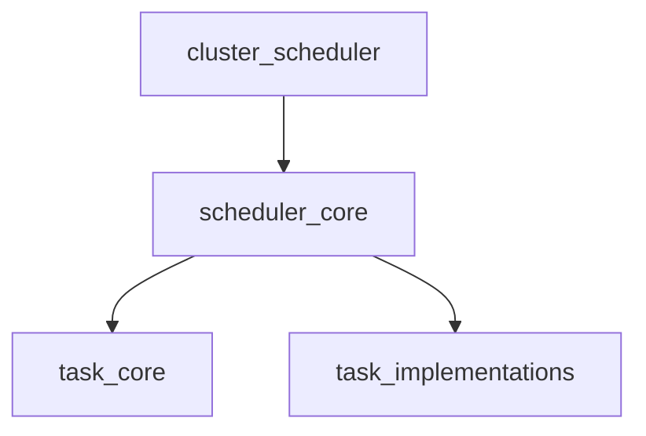

# Scheduler Core Module

The `scheduler_core` module is responsible for the core scheduling logic within the system. It manages the execution of various tasks by maintaining a registry of active tasks and their respective timing mechanisms.

## Purpose

This module ensures that background tasks, optimizations, and data collection processes are executed at their defined intervals, contributing to the overall automation and operational efficiency of the cluster management system.

## Architecture

The `scheduler_core` module primarily consists of the `Scheduler` component, which orchestrates the execution of tasks, and the `taskEntry` component, which encapsulates the timing and concurrency control for individual tasks. It is a fundamental part of the `cluster_scheduler` module, providing the underlying mechanism for task management.

<!-- DIAGRAM_JSON
{
    "direction": "TD",
    "nodes": [
        {"id": "scheduler_core", "label": "Scheduler Core", "type": "module", "link": "scheduler_core.md"},
        {"id": "cluster_scheduler", "label": "Cluster Scheduler", "type": "external", "link": "cluster_scheduler.md"},
        {"id": "task_core", "label": "Task Core", "type": "external", "link": "task_core.md"},
        {"id": "task_implementations", "label": "Task Implementations", "type": "external", "link": "task_implementations.md"}
    ],
    "edges": [
        {"source": "cluster_scheduler", "target": "scheduler_core"},
        {"source": "scheduler_core", "target": "task_core"},
        {"source": "scheduler_core", "target": "task_implementations"}
    ],
    "groups": []
}
-->



## Core Components

### `Scheduler` (`pkg.cluster.scheduler.Scheduler`)

This is the central component of the scheduler. It maintains a concurrent-safe map of active tasks (`tasks`) and provides a mechanism to gracefully shut down the scheduler (`quit` channel).

```go
type Scheduler struct {
	mu    sync.Mutex
	tasks map[string]*taskEntry
	quit  chan struct{}
}
```

### `taskEntry` (`pkg.cluster.scheduler.taskEntry`)

Represents a single scheduled task. It includes a `time.Ticker` to manage the task's execution interval and a `lock` (semaphore of size 1) to ensure that only one instance of the task runs at a time, preventing concurrent execution issues.

```go
type taskEntry struct {
	ticker *time.Ticker
	lock   chan struct{} // semaphore, size 1
}
```

## Relationship to other modules

*   **`cluster_scheduler`**: The `scheduler_core` is a child module of [cluster_scheduler](cluster_scheduler.md), providing the fundamental task scheduling capabilities that `cluster_scheduler` utilizes to manage and execute cluster-wide operations.
*   **`task_core`**: The tasks managed by `scheduler_core` are likely defined by the [task_core](task_core.md) module, which defines the basic `Task` interface or structure.
*   **`task_implementations`**: Concrete implementations of tasks (e.g., `ApplyRecommendationTask`, `CleanupOOMEventsTask`) would interact with the `scheduler_core` by being registered and executed, as detailed in [task_implementations](task_implementations.md).
