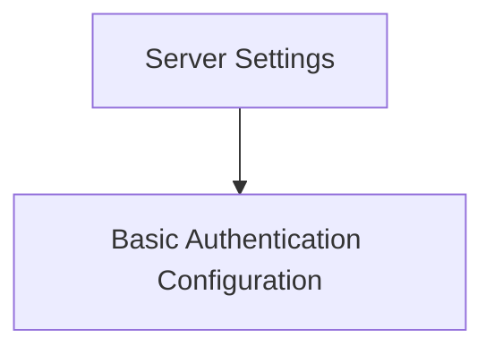

# Server Base Configuration

This module (`server_base_configuration`) defines the fundamental server-wide settings and basic authentication parameters. It provides the core configuration structure for the server, including its operational port and the mechanism for basic user authentication.

## Architecture

The `server_base_configuration` module is composed of two main sub-modules:
- **Server Settings**: Handles the server's port and development API enablement.
- **Basic Authentication Configuration**: Manages the username and password for basic authentication.

<!-- DIAGRAM_JSON
{
    "direction": "TD",
    "nodes": [
        {"id": "server_settings", "label": "Server Settings", "type": "module", "link": "server_settings.md"},
        {"id": "basic_authentication_config", "label": "Basic Authentication Configuration", "type": "module", "link": "basic_authentication_config.md"}
    ],
    "edges": [
        {"source": "server_settings", "target": "basic_authentication_config"}
    ],
    "groups": []
}
-->

## Sub-modules

### [Server Settings](server_settings.md)
This sub-module defines the core server configuration, including the port on which the server listens and a flag to enable/disable development-specific APIs.

### [Basic Authentication Configuration](basic_authentication_config.md)
This sub-module encapsulates the settings related to basic HTTP authentication, specifically the username and password required for access.