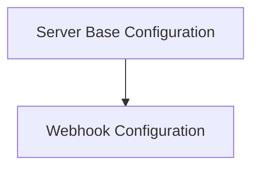

# Server Configuration Module

The `server_configuration` module is responsible for defining and managing the fundamental configuration settings for the server, including network port, authentication mechanisms, webhook settings, and URL structures.

## Architecture Overview

This module centralizes critical server-wide settings, ensuring consistent behavior and secure operation across different components. It provides distinct structures for server operation and webhook management.

<!-- DIAGRAM_JSON
{
    "direction": "TD",
    "nodes": [
        {"id": "server_base_configuration", "label": "Server Base Configuration", "type": "module", "link": "server_base_configuration.md"},
        {"id": "webhook_configuration", "label": "Webhook Configuration", "type": "module", "link": "webhook_configuration.md"}
    ],
    "edges": [
        {"source": "server_base_configuration", "target": "webhook_configuration", "label": "relies on"}
    ],
    "groups": []
}
-->

## Sub-modules

### [Server Base Configuration](server_base_configuration.md)
Handles the core operational settings of the server, such as the listening port and basic authentication credentials. This ensures the server is properly exposed and secured at a foundational level.

### [Webhook Configuration](webhook_configuration.md)
Manages the configuration for the server's webhook functionality. This includes defining the webhook's listening port, the directory for SSL certificates, enabling dry-run mode, and specifying the URL for statistics reporting.
