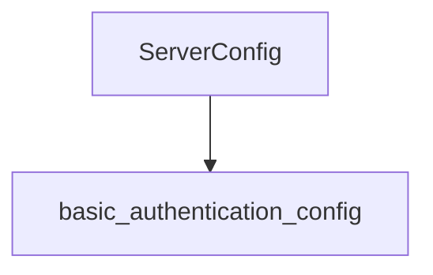

# server_settings

The `server_settings` module is responsible for defining the core server configuration parameters, providing essential settings such as the listening port, basic authentication details, and the enablement of development APIs. It is a fundamental part of the overall application configuration, ensuring the server operates with the desired parameters.

## Core Functionality

This module primarily encapsulates the `ServerConfig` structure, which aggregates key server-related settings.

### ServerConfig

The `ServerConfig` component (defined in `pkg.config.config.ServerConfig`) is a crucial configuration structure that defines the operational parameters for the server.

```go
type ServerConfig struct {
	Port          string          `yaml:"port" mapstructure:"port"`
	BasicAuth     BasicAuthConfig `yaml:"basicAuth" mapstructure:"basicAuth"`
	EnableDevAPIs bool            `yaml:"enableDevAPIs" mapstructure:"enableDevAPIs"`
}
```

-   **Port**: Specifies the network port on which the server will listen for incoming requests.
-   **BasicAuth**: Integrates basic authentication settings, which are detailed in the [basic_authentication_config](basic_authentication_config.md) module. This allows the server to enforce authentication on its endpoints.
-   **EnableDevAPIs**: A boolean flag that controls the availability of development-specific APIs. When set to `true`, these APIs might expose additional functionality useful during development and debugging but typically disabled in production environments.

## Architecture Diagram

This diagram illustrates the internal component of the `server_settings` module and its relationship with external configuration modules.

<!-- DIAGRAM_JSON
{
    "direction": "TD",
    "nodes": [
        {"id": "server_config", "label": "ServerConfig", "type": "component", "link": null},
        {"id": "basic_authentication_config", "label": "basic_authentication_config", "type": "external", "link": "basic_authentication_config.md"}
    ],
    "edges": [
        {"source": "server_config", "target": "basic_authentication_config"}
    ],
    "groups": []
}
-->


## How it Fits into the Overall System

The `server_settings` module is a vital part of the `configuration` module, specifically nested under `server_configuration` and `server_base_configuration`. It provides the foundational settings required for the server's operation. By centralizing these settings, it ensures consistency and ease of management for the server's runtime behavior. Its dependency on `basic_authentication_config` highlights how different configuration aspects are modularized yet interconnected, allowing for a clear separation of concerns while maintaining a comprehensive server setup. This module's configuration is loaded at application startup, dictating the server's network and security posture from the outset.
