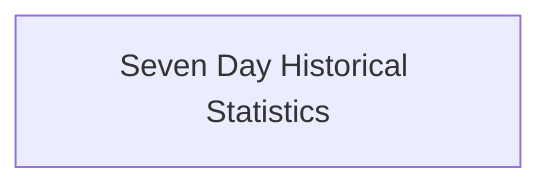

<!-- AUTO_GENERATED_PLACEHOLDER
  reason: LLM did not create .md file for this module
  module_path: data_types/stats_types/container_metrics/seven_day_stats
  component_count: 2
  generated_at: 2026-02-03T14:34:07.352274
  TODO: Fix LLM prompt to handle small leaf modules
-->

# Seven Day Historical Statistics

> ⚠️ **Auto-Generated Placeholder**
> This documentation was auto-generated because the LLM failed to create it.
> Module path: `data_types/stats_types/container_metrics/seven_day_stats`

Provides data structures for CPU and Memory usage statistics collected over a 7-day period.

## Components

This module contains 2 component(s):

- `pkg.types.stats.CPU7DayStats`
- `pkg.types.stats.Memory7DayStats`

## Structure

---
*Auto-generated placeholder. See sync_issues.json for details.*
