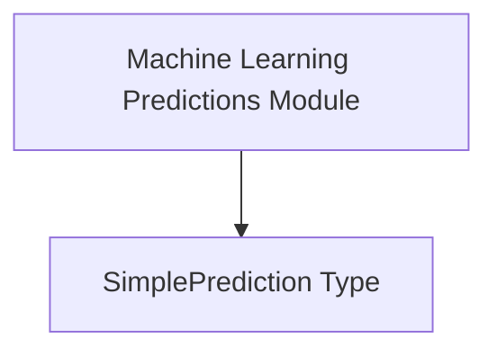

# simple_predictions Module Documentation

The `simple_predictions` module is a leaf module within the `data_types` and `stats_types` hierarchy. Its primary purpose is to define the data structure used to encapsulate simple prediction results, particularly within machine learning contexts.

## Purpose and Core Functionality

This module defines the `SimplePrediction` struct, which provides a standardized format for storing and communicating prediction values. It consolidates various time-based predictions and a maximum value into a single, easy-to-use structure.

### `SimplePrediction` Component

The `pkg.types.stats.SimplePrediction` struct captures the following prediction-related data:

```go
type SimplePrediction struct {
	WeeklyPrediction  float64 `json:"weekly_prediction"`
	HourlyPrediction  float64 `json:"hourly_prediction"`
	CurrentPrediction float64 `json:"current_prediction"`
	MaxValue          float64 `json:"max_value"`
}
```

*   `WeeklyPrediction`: Represents a predicted value over a weekly period.
*   `HourlyPrediction`: Represents a predicted value over an hourly period.
*   `CurrentPrediction`: Represents the most recent or current predicted value.
*   `MaxValue`: Represents the maximum observed or predicted value, providing a bound or peak reference.

## Architecture and Component Relationships

The `simple_predictions` module is a fundamental data structure component, providing a clear definition for prediction objects. It is a sub-module of `machine_learning_predictions`, which in turn is part of `stats_types`.

<!-- DIAGRAM_JSON
{
    "direction": "TD",
    "nodes": [
        {"id": "simple_prediction_type", "label": "SimplePrediction Type", "type": "component", "link": null},
        {"id": "machine_learning_predictions", "label": "Machine Learning Predictions Module", "type": "external", "link": "machine_learning_predictions.md"}
    ],
    "edges": [
        {"source": "machine_learning_predictions", "target": "simple_prediction_type"}
    ],
    "groups": []
}
-->


## How the Module Fits into the Overall System

The `simple_predictions` module, through its `SimplePrediction` struct, serves as a crucial data carrier for predicted metrics throughout the system. It is utilized by higher-level modules, such as [machine_learning_predictions](machine_learning_predictions.md), to store and manage the output of prediction algorithms. This struct ensures consistency in how prediction data is represented, facilitating integration with various statistical and analytical components, as well as reporting and monitoring systems. It is an integral part of the broader [data_types](data_types.md) and [stats_types](stats_types.md) modules, providing the foundational types for statistical data handling.
