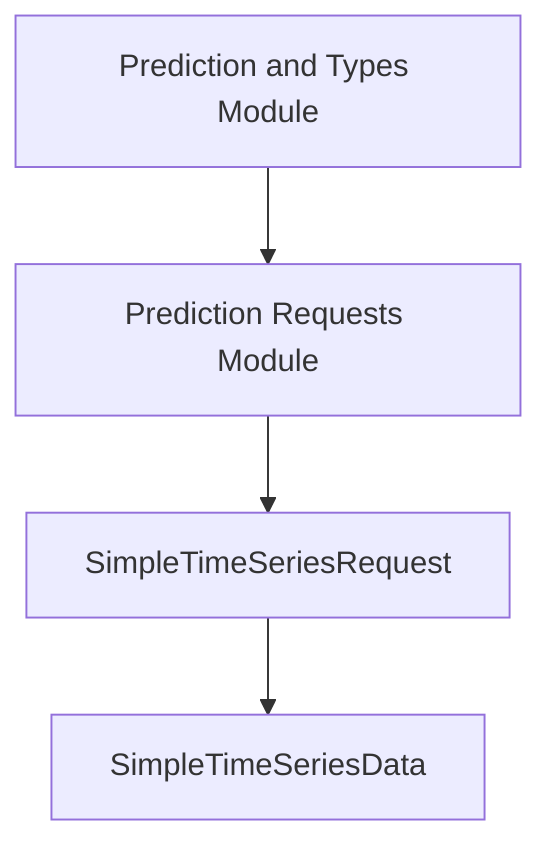

# simple_time_series_data_models

## Introduction
The `simple_time_series_data_models` module defines fundamental data structures for representing and requesting simple time series data within the system. It provides basic models for encapsulating time-stamped values, primarily used for tasks requiring straightforward time series input for analysis or prediction.

## Core Functionality
This module serves as a foundational layer for time series data handling, offering two key data models:
- `SimpleTimeSeriesData`: Represents a single time series with an associated entity name, a list of timestamps, and their corresponding numerical values.
- `SimpleTimeSeriesRequest`: Aggregates one or more `SimpleTimeSeriesData` objects, facilitating requests involving multiple time series datasets.

These models are crucial for various time-series related operations, especially within the `task_utilities` and `prediction_and_types` modules, where they support simpler prediction requests compared to more complex time series models.

## Architecture and Component Relationships
The `simple_time_series_data_models` module is a sub-module of `prediction_requests`, which in turn is part of `prediction_and_types`. It provides the basic building blocks for time series data representation.

<!-- DIAGRAM_JSON
{
    "direction": "TD",
    "nodes": [
        {"id": "simple_time_series_request", "label": "SimpleTimeSeriesRequest", "type": "component", "link": null},
        {"id": "simple_time_series_data", "label": "SimpleTimeSeriesData", "type": "component", "link": null},
        {"id": "prediction_requests", "label": "Prediction Requests Module", "type": "external", "link": "prediction_requests.md"},
        {"id": "prediction_and_types", "label": "Prediction and Types Module", "type": "external", "link": "prediction_and_types.md"}
    ],
    "edges": [
        {"source": "simple_time_series_request", "target": "simple_time_series_data"},
        {"source": "prediction_requests", "target": "simple_time_series_request"},
        {"source": "prediction_and_types", "target": "prediction_requests"}
    ],
    "groups": []
}
-->



## Module Components

### SimpleTimeSeriesRequest
```go
type SimpleTimeSeriesRequest struct {
	TimeSeriesData []SimpleTimeSeriesData `json:"timeseries_data"`
}
```
This structure encapsulates a request for time series data, containing a slice of `SimpleTimeSeriesData` objects. It is used to submit multiple individual time series for processing or prediction.

### SimpleTimeSeriesData
```go
type SimpleTimeSeriesData struct {
	EntityName string    `json:"entity_name"`
	Timestamps []string  `json:"timestamps"`
	Values     []float64 `json:"values"`
}
```
This structure represents a single time series.
- `EntityName`: A string identifier for the entity the time series belongs to.
- `Timestamps`: A slice of strings, where each string represents a timestamp.
- `Values`: A slice of float64 values, corresponding to the `Timestamps` entries.
