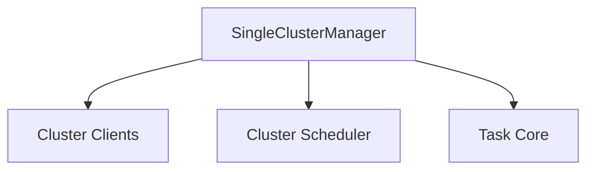

# `single_cluster_manager` Module Documentation

The `single_cluster_manager` module is a crucial component within the `cluster_management` system, responsible for orchestrating operations and managing resources for a single Kubernetes cluster. It integrates various functionalities such as cluster client management, task scheduling, and task execution, providing a centralized point of control for cluster-specific activities.

### Core Functionality

The primary responsibility of the `SingleClusterManager` is to:
*   Maintain client connections to the managed cluster, enabling interaction with its various components.
*   Utilize a scheduler to manage and dispatch tasks related to the cluster.
*   Keep track of and execute registered tasks specific to the cluster's operational needs.

### Architecture and Component Relationships

The `single_cluster_manager` module, primarily embodied by the `SingleClusterManager` struct, acts as an orchestrator, depending on several other modules to fulfill its responsibilities.

The `SingleClusterManager` struct is defined as follows:

```go
type SingleClusterManager struct {
	clusterClients  map[string]*ClusterClients
	mu              sync.RWMutex
	scheduler       *Scheduler
	registeredTasks map[string]task.Task
}
```

*   **`clusterClients`**: A map holding instances of `ClusterClients` (from the `cluster_clients` module). This allows the manager to maintain and access various client connections to the single managed cluster.
*   **`mu`**: A `sync.RWMutex` to ensure thread-safe access to the manager's internal state, particularly when dealing with `clusterClients` and `registeredTasks`.
*   **`scheduler`**: A pointer to a `Scheduler` instance (from the `cluster_scheduler` module). This dependency highlights that the `SingleClusterManager` offloads the responsibility of task scheduling to a dedicated scheduling component.
*   **`registeredTasks`**: A map of strings to `task.Task` instances (from the `task_core` module). This enables the manager to register, store, and execute various operational tasks specific to the cluster.

### System Integration

The `single_cluster_manager` fits into the broader system as the concrete implementation of a cluster manager for a single cluster environment. It leverages the generic `ClusterClients` for connectivity, the `Scheduler` for task orchestration, and the `task_core` for defining executable tasks. This modular design allows for clear separation of concerns, where `SingleClusterManager` focuses on managing a single cluster while delegating specialized functions to other dedicated modules.

<!-- DIAGRAM_JSON
{
    "direction": "TD",
    "nodes": [
        {"id": "single_cluster_manager", "label": "SingleClusterManager", "type": "component", "link": null},
        {"id": "cluster_clients", "label": "Cluster Clients", "type": "external", "link": "cluster_clients.md"},
        {"id": "cluster_scheduler", "label": "Cluster Scheduler", "type": "external", "link": "cluster_scheduler.md"},
        {"id": "task_core", "label": "Task Core", "type": "external", "link": "task_core.md"}
    ],
    "edges": [
        {"source": "single_cluster_manager", "target": "cluster_clients"},
        {"source": "single_cluster_manager", "target": "cluster_scheduler"},
        {"source": "single_cluster_manager", "target": "task_core"}
    ],
    "groups": []
}
-->
